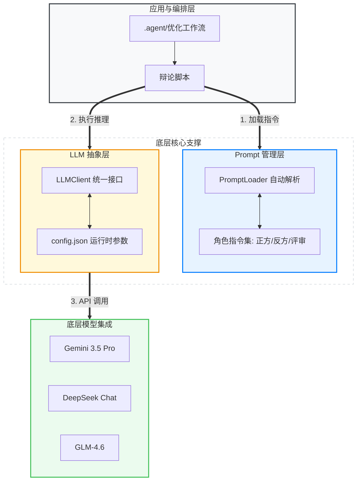
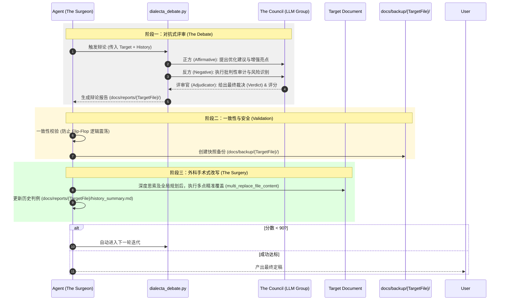

# ⚡ SparkForge 2.0: AI 驱动的决策与执行规划引擎

> **Mission**: 将挥发性的原始创意（Vaporous Ideas）锻造成工业级的执行方案（Industrial-Grade Execution Plans）。

---

## 🧠 项目愿景

SparkForge 是一个高保真智能引擎框架，旨在通过 **AI 辩论 (Adversarial AI)**、**自动化工作流** 和 **深度验证体系**，协助组织将复杂想法转化为高保真、可执行的专业化方案。

## 🛠️ 核心架构：SparkForge-3 框架

本项目遵循严苛的 **Forge-3 流程**，确保每一份产出都具备实战价值：

1.  **Expansion (The Flesh - 扩张)**: 
    *   创新性增强：在原始需求基础上增加高价值逻辑组件。
    *   架构蓝图：使用 Mermaid.js 可视化逻辑流。
2.  **Validation (The Bone - 验证)**:
    *   批判性审计：通过 AI 委员会 (The Council) 进行多维度审核，识别单点故障。
    *   硬核规避：提供经过压力测试的解决方案。
3.  **Action (The Path - 行动)**:
    *   即时路径：产出以动词开头的结构化任务矩阵。
    *   上下文感知：确保所有路径与现有工程结构（`/scripts`, `/docs`）无缝对齐。

---

## 📂 核心资源说明

| 目录/文件      | 功能定义      | 关键组件                                                       |
| :------------- | :------------ | :------------------------------------------------------------- |
| **`.agent/`**  | 智能体工作流  | `optimize-design-loop.md`: 涵盖备份与一致性校验的闭环优化流。  |
| **`docs/`**    | 文档资产库    | 存放待评审的原始草案、规划书及决策结果。                       |
| **`scripts/`** | 自动化工具集  | `dialecta_debate.py`: 核心辩论驱动程序，支持多角色博弈评审。   |
| **`prompts/`** | Prompt 管理层 | Markdown 驱动的指引集，通过 YAML Front Matter 管理模型元数据。 |
| **`llm/`**     | LLM 抽象层    | 统一交互接口、供应商配置管理与多模型适配。                     |

---

## 🏗️ 基础架构：底层支撑工具

SparkForge 的稳定性与灵活性建立在两个核心底层支撑层之上：



### 1. LLM 抽象层 (`llm/`)
*   **统一交互语义**: 封装了 `chat` (同步) 与 `achat` (异步) 接口，屏蔽了不同 LLM 供应商的接口差异。
*   **Provider 配置管理**: 通过 `llm/config.json` 集中管理模型参数（如 Temperature, Max Tokens）与接入地址。支持 `${ENV_VAR}` 占位符解析，确保 API Key 等机密信息的环境注入。
*   **鲁棒性机制**: 实现了请求参数的深度合并、错误处理与 Usage 统计，为上层 `dialecta_debate.py` 提供可靠的推理底座。

### 2. Prompt 管理层 (`prompts/`)
*   **Markdown-as-Code**: 采用 Markdown 存储 System Prompts，极大提升了指令内容的可读性与可维护性。
*   **元数据解耦**: 通过 Markdown 顶部的 **YAML Front Matter** 定义该角色推荐的模型配置（如 `model`, `provider`），实现了“提示词内容”与“推理硬件参数”的深度耦合。
*   **自动解析器**: 内部 `PromptLoader` 会自动扫描目录下的所有 Markdown 文件，将其动态解析为结构化对象。内容专家可以直接在 Git 中通过修改 Markdown 来调整 AI 行为，无需接触核心逻辑代码。

---

## 🚀 核心工作流：Dialecta 辩论优化循环

SparkForge 的核心价值在于其 **“对抗式优化” (Adversarial Optimization)** 机制。该流程结合了脚本驱动的 AI 辩论与 Agent 驱动的文档手术，形成一个闭环的迭代系统。

### 1. 完整流程总览 (Sequence Diagram)



### 2. 辩论脚本内部逻辑 (`dialecta_debate.py`)
脚本不仅是一个调用器，它在内部维护了一个 **“结构化认知” (Structured Cognition)** 过程：
*   **上下文构建**: 融合用户指令、历史判例 (`--ref`) 与待审材料。
*   **多模型协同**: 支持为正、反、评三方配置不同的 LLM 模型 (见 `llm/` 配置)，以利用不同模型在逻辑与创意上的特质。
*   **证据链对齐**: 评审官必须在正反两方的陈述基础上做出判决，确保优化的每一步都有据可查。

### 3. Agent 手术机制 (`The Surgeon`)
该步骤并非机械化的内容覆盖，而是 Agent 在执行前的 **“二次创作规划”**。Agent 以“外科医生”的身份操作：
*   **深度思索与规划**: 在改写前，Agent 会通盘考虑评审意见对文档全局逻辑的影响，制定优化路线图，确保改写后的内容自洽且流畅。
*   **分析裁决**: 深度解析评审建议，区分“必须修复”的硬性缺陷与“参考优化”的弹性建议。
*   **解决冲突**: 若本轮裁决与历史判例冲突，Agent 需进行逻辑抉择并更新 `docs/reports/{TargetFile}/history_summary.md` 中的决策理由，从根源上杜绝逻辑震荡 (Flip-Flop)。

## 🚥 快速开始

### 1. 环境准备
```bash
# 安装依赖
pip install -r requirements.txt

# 配置环境变量 (推荐在 .env 文件中设置)
# LLM_PROVIDER=gemini
# GEMINI_API_KEY=your_key_here
```

### 2. 单次对抗式评审 (Manual Debate)
若仅需对特定文档进行一次性评审并生成报告：
```bash
python3 scripts/dialecta_debate.py {your_document.md} --instruction "你的评审指令"
```
*   **产出位置**: `docs/reports/{FileName}/debate_{timestamp}.md`

### 3. 自动化持续优化循环 (Automated Loop)
这是 SparkForge 的**核心能力**。通过 IDE 加载 `.agent/workflows/optimize-design-loop.md`，Agent 将自动执行以下闭环：
1.  **自动审计**: 调用 `dialecta_debate.py` 生成深度评审意见。
2.  **安全保护**: 自动在 `docs/backup/{FileName}/` 创建带时间戳的快照。
3.  **智能重构**: Agent 深度思考评审建议，通过 `multi_replace_file_content` 执行多点精准修复。
4.  **知识沉淀**: 自动维护 `docs/reports/{FileName}/history_summary.md`（判例法）。
5.  **自我迭代**: 若评分低于 90，自动进入下一轮评审，直至定稿。

> **提示**: 在 IDE 中输入 `/optimize-design-loop` 即可快速唤起该工作流。

---

## 👔 设计美学
*   **语义锚点**：使用 ⚡ (行动), 🧠 (分析), 🔒 (安全) 等图标增强语义识别。
*   **客观严谨**：拒绝任何模棱两可的表达，所有结论必须基于数据或逻辑推演。
*   **追求卓越**：文档不仅仅是文字，更是可执行的资产。

---
© 2025 SparkForge High-Fidelity Intelligence Engine.
