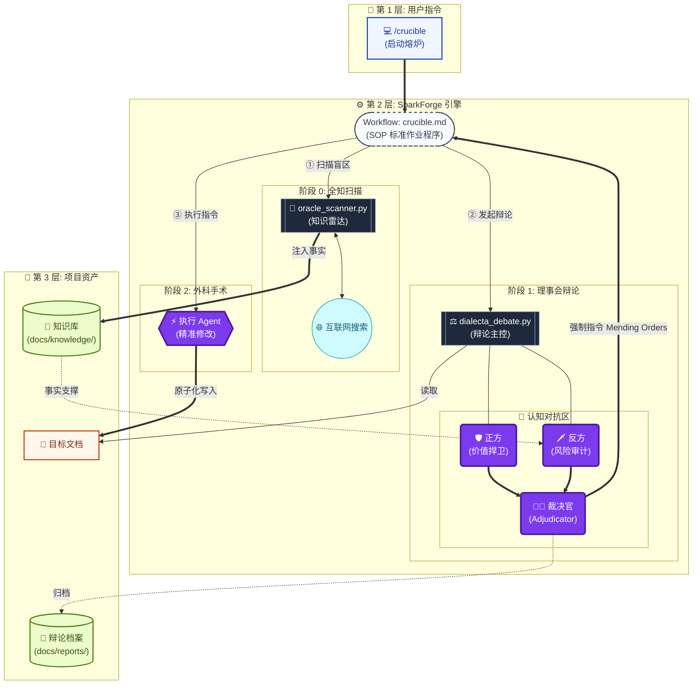

# ⚡ SparkForge: The Crucible Engine

  

> **使命 (Mission)**: 通过 **Oracle 事实锚定** 与 **对抗式辩论** 的双重熔炉，将挥发的原始创意锻造成经得起现实检验的工业级执行方案。

---

## 🧠 核心理念：The Crucible (熔炉)

SparkForge 不仅仅是一个文档生成器，它是一个 **认知熔炉**。它通过 **"The Crucible"**工作流，强制所有文档经历 "事实扫描 -> 激烈辩论 -> 逻辑收敛 -> 外科手术" 的迭代循环，直至其变成坚不可摧的交付物。

## 🛠️ 核心架构：Crucible Protocol

本项目遵循严苛的 **Crucible 协议**，这是一套集成外部知识与内部对抗的闭环系统：

1.  **Phase 0: Oracle Scanning (全知扫描)**
    -   **雷达锁定**: 在辩论前夕，自动调动 `oracle_scanner.py` 扫描文档中的知识盲区。
    -   **事实锚定**: 通过 `Find -> Verify -> Inject` 循环，将外部实时数据注入本地知识库 (`docs/knowledge/`)，防止闭门造车。

2.  **Phase 1: Council Debate (理事会辩论)**
    -   **多模态对抗**: 调用顶级 LLM (DeepSeek/Qwen/GLM) 分区扮演 Affirmative (价值捍卫者) 与 Negative (风险审计员)。
    -   **事实对抗**: Negative 角色被强制要求基于 Oracle 提供的知识进行攻击，而非凭空质疑。

3.  **Phase 2: Adjudication & Mending (裁决与修补)**
    -   **元裁决**: Adjudicator 综合双方论点与事实依据，给出量化评分与强制性的 "Mending Orders" (修补指令)。
    -   **退出机制**: 只有当评分 >90 或达到最大循环次数时，熔炉才会开启出口。

4.  **Phase 3: Surgical Action (外科手术)**
    -   **精准执行**: Agent 执行 Adjudicator 的指令，对文档进行原子化修改。
    -   **审计日志**: 每一次参数修正与逻辑调整都被记录在案。

---

## 📂 系统版图

| 模块           | 核心组件                                                               | 职责描述                                                                            |
| :------------- | :--------------------------------------------------------------------- | :---------------------------------------------------------------------------------- |
| **`.agent/`**  | **`/workflows/`**                                                      | **战略编排器**: 包含 `crucible.md` (熔炉协议) 等标准作业程序 (SOP)。                |
| **`llm/`**     | **`client.py`**<br>**`config.json`**                                   | **推理中枢**: 统一的 LLM 接口网关，集成 DeepSeek/Qwen/GLM。支持动态 Token 管理。    |
| **`prompts/`** | **`*.md`**                                                             | **认知配置**: 存储 `negative.md`, `adjudicator.md` 等系统提示词，定义 AI 认知边界。 |
| **`scripts/`** | **`oracle_scanner.py`**<br>**`dialecta_debate.py`**<br>**`pdf_tool/`** | **执行引擎**: 知识扫描、辩论调度、PDF 交付。                                        |
| **`docs/`**    | **`knowledge/`**<br>**`reports/`**                                     | **资产仓库**: 隔离存储外部事实知识库与辩论档案。                                    |

---

## 🏗️ 架构之魂：System Panorama



---

## 🚀 核心工作流：The Crucible

这是 SparkForge 的终极形态。

### 1. 启动熔炉

在 IDE 中打开目标文档，输入指令：

```bash
/crucible "优化目标描述"
```

**发生了什么？**
1.  **Oracle 扫描**: 系统首先运行 `oracle_scanner.py`，找出文档中的弱点（外部知识盲区）。
2.  **知识注入**: 最新鲜的外部事实（法规、数据、案例）被存入 `docs/knowledge/`。
3.  **理事会辩论**: `dialecta_debate.py` 启动，Negative 辩手手持 Oracle 知识对文档发起猛烈攻击。
4.  **裁决与修补**: 最后，Agent 根据裁决结果，对文档进行精准修改。
5.  **循环**: 这个过程会自动循环 (Loop 1 -> Loop 2...)，直到文档达到 90 分或用户满意。

### 2. 辅助工具链

#### 🔮 Oracle Scanner (手动触发)
如果你只想检查文档的知识盲区，而不进行完整辩论：
```bash
python3 scripts/oracle_scanner.py {文档路径}
```

#### ⚖️ Dialecta Debate (手动触发)
如果你已有知识库，只想进行逻辑审计：
```bash
python3 scripts/dialecta_debate.py {文档路径} --oracle {knowledge_file}
```

#### 📄 PDF Export (交付)
将打磨好的文档导出为精美 PDF：
```bash
make glass {文档路径}  # 适合移动端阅读的长图风格
make a4 {文档路径}     # 适合打印的商务风格
```

---

## 🎨 核心设计哲学

-   **Oracle Grounding (事实锚定)**: 内部逻辑再完美，如果违背外部事实（法规、物理定律、市场数据），也是废品。
-   **Adversarial Resilience (对抗鲁棒性)**: 没有经过攻击的观点是不值得信任的。
-   **Audit Trail (审计留痕)**: 每一次决策、每一个参数的修改，都必须可追溯。

---

© 2025 SparkForge High-Fidelity Intelligence Engine.

