# ⚡ SparkForge 2.0: AI 驱动的决策与执行规划引擎

> **Mission**: 将挥发性的原始创意（Vaporous Ideas）锻造成工业级的执行方案（Industrial-Grade Execution Plans）。

---

## 🧠 项目愿景

SparkForge 是一个高保真智能引擎框架，旨在通过 **AI 辩论 (Adversarial AI)**、**自动化工作流** 和 **深度验证体系**，协助组织将复杂想法转化为高保真、可执行的专业化方案。

## 🛠️ 核心架构：SparkForge-3 框架

本项目遵循严苛的 **Forge-3 流程**，确保每一份产出都具备实战价值：

1.  **Expansion (The Flesh - 扩张)**: 
    *   创新性增强：在原始需求基础上增加高价值逻辑组件。
    *   架构蓝图：使用 Mermaid.js 可视化逻辑流。
2.  **Validation (The Bone - 验证)**:
    *   批判性审计：通过 AI 委员会 (The Council) 进行多维度审核，识别单点故障。
    *   硬核规避：提供经过压力测试的解决方案。
3.  **Action (The Path - 行动)**:
    *   💧 **Atomic Safety**: 实现了文档与历史记录的“原子化备份与回滚”，确保优化失败时状态可控。
    *   即时路径：产出以动词开头的结构化任务矩阵。
    *   上下文感知：确保所有路径与现有工程结构（`/scripts`, `/docs`）无缝对齐。

---

## 📂 核心资源说明

| 目录/文件      | 功能定义      | 关键组件                                                             |
| :------------- | :------------ | :------------------------------------------------------------------- |
| **`.agent/`**  | 智能体工作流  | `optimize-design-loop.md`: 支持原子化回滚、冲突检测与历史压缩。      |
| **`docs/`**    | 文档资产库    | `reports/`: 采用相对路径命名空间的辩论记录；`backup/`: 迭代快照。    |
| **`scripts/`** | 自动化工具集  | `dialecta_debate.py`: 支持引文越界检测、逻辑脉冲输出与日志自动清理。 |
| **`prompts/`** | Prompt 管理层 | `adjudicator.md`: 强化引文要求与存在性审查指令。                     |
| **`llm/`**     | LLM 抽象层    | 统一交互接口、供应商配置管理与多模型适配。                           |

---

## 🏗️ 基础架构：底层支撑工具

SparkForge 的稳定性与灵活性建立在两个核心底层支撑层之上：

```mermaid
graph TD
    %% 定义顶层应用
    subgraph App_Layer [应用与编排层]
        direction TB
        Workflow[.agent/优化工作流] --> Script[辩论脚本]
    end

    %% 中间支撑层并行排列
    subgraph Infrastructure [底层核心支撑]
        direction LR
        subgraph Prompt_Layer [Prompt 管理层]
            direction TB
            Loader[PromptLoader 自动解析]
            Roles[角色指令集: 正方/反方/评审]
            Loader <--> Roles
        end

        subgraph LLM_Layer [LLM 抽象层]
            direction TB
            Client[LLMClient 统一接口]
            Config[config.json 运行时参数]
            Client <--> Config
        end
    end

    %% 底层模型集成
    subgraph Model_Base [底层模型集成]
        direction LR
        M1[Gemini 3.5 Pro]
        M2[DeepSeek Chat]
        M3[GLM-4.6]
    end

    %% 核心交互链路
    Script ==>|1. 加载指令| Prompt_Layer
    Script ==>|2. 执行推理| LLM_Layer
    LLM_Layer ==>|3. API 调用| Model_Base

    %% 样式美化
    style App_Layer fill:#f8f9fa,stroke:#343a40,stroke-width:2px
    style Prompt_Layer fill:#e7f3ff,stroke:#007bff,stroke-width:2px
    style LLM_Layer fill:#fff9db,stroke:#f08c00,stroke-width:2px
    style Model_Base fill:#ebfbee,stroke:#40c057,stroke-width:2px
    style Infrastructure fill:none,stroke:#ced4da,stroke-dasharray: 5 5
```



### 1. LLM 抽象层 (`llm/`)
*   **统一交互语义**: 封装了 `chat` (同步) 与 `achat` (异步) 接口，屏蔽了不同 LLM 供应商的接口差异。
*   **Provider 配置管理**: 通过 `llm/config.json` 集中管理模型参数（如 Temperature, Max Tokens）与接入地址。支持 `${ENV_VAR}` 占位符解析，确保 API Key 等机密信息的环境注入。
*   **鲁棒性机制**: 实现了请求参数的深度合并、错误处理与 Usage 统计，为上层 `dialecta_debate.py` 提供可靠的推理底座。

### 2. Prompt 管理层 (`prompts/`)
*   **Markdown-as-Code**: 采用 Markdown 存储 System Prompts，极大提升了指令内容的可读性与可维护性。
*   **元数据解耦**: 通过 Markdown 顶部的 **YAML Front Matter** 定义该角色推荐的模型配置（如 `model`, `provider`），实现了“提示词内容”与“推理硬件参数”的深度耦合。
*   **自动解析器**: 内部 `PromptLoader` 会自动扫描目录下的所有 Markdown 文件，将其动态解析为结构化对象。内容专家可以直接在 Git 中通过修改 Markdown 来调整 AI 行为，无需接触核心逻辑代码。

---

## 🚀 核心工作流：Dialecta 辩论优化循环

SparkForge 的核心价值在于其 **“对抗式优化” (Adversarial Optimization)** 机制。该流程结合了脚本驱动的 AI 辩论与 Agent 驱动的文档手术，形成一个闭环的迭代系统。

### 1. 完整流程总览 (Sequence Diagram)

```mermaid
sequenceDiagram
    autonumber
    participant Agent as Agent (The Surgeon)
    participant Script as dialecta_debate.py
    participant Council as The Council (LLM Group)
    participant Doc as Target Document
    participant History as history_summary.md

    rect rgb(240, 240, 240)
    Note over Agent, History: 阶段一：上下文感知 (Contextualization)
    Agent->>Agent: Step 1: 滚动历史裁剪 (Pruning) & 压缩
    Agent->>Script: 触发协作 (注入当前目标 + 裁剪后判例)
    end

    rect rgb(248, 248, 255)
    Note over Script, Council: 阶段二：安全与对抗 (Safety & Debate)
    Script->>Script: 命名空间隔离 (Namespace Isolation)
    par 正反方博弈 (Parallel Execution)
        Script->>Council: 正方 (Affirmative)
        Script->>Council: 反方 (Negative)
    end
    Council-->>Script: 评审官: 裁决 (Verdict) & 线条引文考核
    Script->>Script: 引文幻觉审计 (Line Bounds Check)
    Script-->>Agent: 输出逻辑脉冲 (Logic Pulse) & 报告
    end

    rect rgb(224, 255, 224)
    Note over Agent, Doc: 阶段三：原子化演进 (Atomic Evolution)
    Agent->>Agent: Step 3: 分数审计 (如 Delta < -10 -> 原子化回滚)
    Agent->>Doc: 外科手术式改写 (Surgeon Logic)
    Agent->>History: 更新 Action Trace (记录改写意图)
    end

    alt 分数 < 90?
        Agent->>Agent: 携带“影响矩阵”进入下一轮
    else 成功达标
        Agent-->>User: 产出最终定稿
    end
```



### 2. 辩论脚本内部逻辑 (`dialecta_debate.py`)
脚本不仅是一个调用器，它在内部维护了一个 **“结构化认知” (Structured Cognition)** 过程：
*   **引文真实性审计**: 内置 `Line Bounds Check`，自动识别并警告裁决过程中的引文幻觉（引用了非实有行号）。
*   **观测度增强**: 控制台实时输出 **“逻辑脉冲” (Logic Pulse)**，直接暴露正反方核心冲突。
*   **命名空间保护**: 基于目标的相对路径自动生成报告目录（如 `docs/reports/docs/mypath/`），彻底消除同名脚本的报告冲突。

### 3. Agent 手术机制 (`The Surgeon`)
该步骤并非机械化的内容覆盖，而是 Agent 在执行前的 **“二次创作规划”**。Agent 以“外科医生”的身份操作：
*   **目标性对齐 (Objective Alignment)**: 在改写前，Agent 会严格对比评审意见与 `# Initial Optimization Objective`，确保迭代过程中不会出现“目标漂移”。
*   **深度思索与规划**: 制定优化路线图，确保改写后的内容在全局逻辑上自洽且流畅。
*   **冲突解决与知识固化**: 若裁决与历史判例冲突，Agent 需进行逻辑抉择并更新 `history_summary.md`。该文件不仅记录变动，更作为“持久化记忆”引导下一轮 Council 辩论。

## 🚥 快速开始

### 1. 环境准备
```bash
# 安装依赖
pip install -r requirements.txt

# 配置环境变量 (推荐在 .env 文件中设置)
# LLM_PROVIDER=gemini
# GEMINI_API_KEY=your_key_here
```

### 2. 单次对抗式评审 (Manual Debate)
若仅需对特定文档进行一次性评审并生成报告：
```bash
python3 scripts/dialecta_debate.py {your_document.md} --instruction "你的评审指令"
```
*   **产出位置**: `docs/reports/{Relative_Path}/{TargetFile_Stem}/debate_{timestamp}.md`

### 3. 自动化持续优化循环 (Automated Loop)
这是 SparkForge 的**核心能力**。通过 IDE 加载 `.agent/workflows/optimize-design-loop.md`，Agent 将自动执行以下闭环：
1.  **自动审计**: 调用 `dialecta_debate.py`，注入**当前目标**与裁剪后的历史背景，生成带元数据追踪的评审意见。
2.  **原子化保护**: 在 `docs/backup/{FileName}/` 同时备份文档与 `history_summary.md`，支持失败时的全状态恢复。
3.  **意图追踪 (Action Trace)**: Agent 在修改文档后显式记录“变更影响矩阵”，作为意图证据链引导下一轮评审。
4.  **知识压缩**: 滚动维护历史摘要，通过 `Legacy Context Summary` 压缩早期冗余信息，维持 Context 高能效。
5.  **自我迭代**: 若评分达不到 90 或未被 Approved，自动携带上下文进入下一轮。

> **提示**: 在 IDE 中输入 `/optimize-design-loop` 即可快速唤起该工作流。

---

## 👔 设计美学
*   **语义锚点**：使用 ⚡ (行动), 🧠 (分析), 🔒 (安全) 等图标增强语义识别。
*   **客观严谨**：拒绝任何模棱两可的表达，所有结论必须基于数据或逻辑推演。
*   **追求卓越**：文档不仅仅是文字，更是可执行的资产。

---
© 2025 SparkForge High-Fidelity Intelligence Engine.
