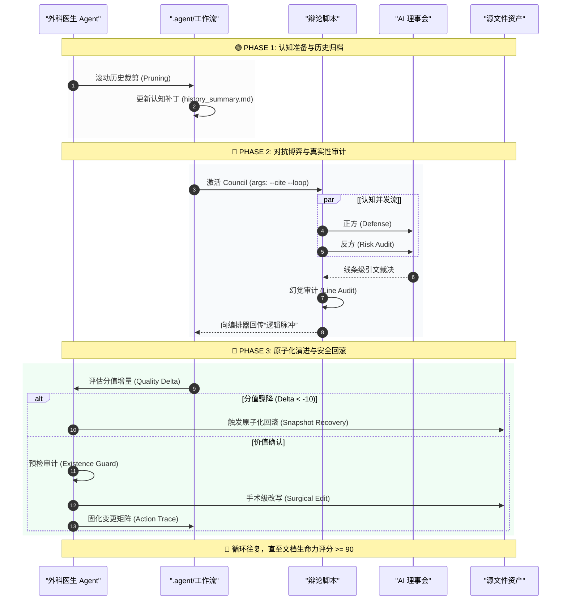

# ⚡ SparkForge 2.0: AI 原生决策与执行规划引擎

> **使命 (Mission)**: 通过对抗式 AI (Adversarial AI) 与外科手术级精度，将挥发的原始创意锻造成工业级的执行方案。

---

## 🧠 战略愿景

SparkForge 是一个专为高风险决策设计的高保真智能框架。它利用 **AI 理事会辩论 (The Council)**、**原子化安全机制** 以及 **外科手术式文档演进**，确保每一份产出不仅是“优秀”，更是经过压力测试、可直接落地的生产力资产。

## 🛠️ 核心架构：SparkForge-3 流程

本项目遵循严苛的 **Forge-3 协议**，这是一套针对文档完美的工业级流水线：

1.  **Expansion (The Flesh - 扩张)**: 
    *   **认知增强**: 超越基础扩充，注入高价值架构组件与边界逻辑。
    *   **视觉蓝图**: 自动生成 Mermaid.js 流程图，通过可视化理清复杂逻辑。
2.  **Validation (The Bone - 验证)**:
    *   **理事会辩论**: 多模型对抗过程，正反方对每一项声明进行博弈。
    *   **引文一致性**: 内置 `Line Bounds Check` 机制，自动审计并消除引文幻觉。
3.  **Action (The Path - 行动)**:
    *   **外科手术式重构**: Agent 作为“外科医生”，在执行原子化修改前校验理事会反馈的真实性。
    *   **原子化安全**: 💧 每次迭代都具备完整的状态恢复路径 (`docs/backup/`)。

---

## 📂 系统版图

| 模块           | 核心职责       | 关键技术                                                       |
| :------------- | :------------- | :------------------------------------------------------------- |
| **`.agent/`**  | **战略编排器** | `optimize-design-loop.md`: 实现滚动历史裁剪与原子化回滚。      |
| **`scripts/`** | **执行引擎**   | `dialecta_debate.py`: 并行认知并发与“逻辑脉冲”遥测。           |
| **`llm/`**     | **推理中枢**   | 统一集成 Gemini 3、DeepSeek 与 GLM-4.6 (System 2) 等推理模型。 |
| **`prompts/`** | **认知配置层** | 采用嵌入 YAML 参数的 Markdown 模板，实现“提示词即代码”。       |
| **`docs/`**    | **资产仓库**   | 命名空间隔离的报告与迭代状态快照。                             |

---

## 🏗️ 架构之魂：SparkForge 系统全景

SparkForge 的设计哲学是“层级解耦，逻辑内聚”。其架构不仅是代码的堆叠，更是认知对抗流程的实体化。


---

### 1. LLM 推理中枢 (`llm/`)
*   **供应商无关性**: 统一 `chat` / `achat` 标准接口，实现 Gemini、DeepSeek 与 OpenAI 的原子化替换。
*   **环境自感知**: `config.json` 集中治理 Token 边界与温度参数，支持环境敏感的推理容量预测。

### 2. Prompt 语义工程 (`prompts/`)
*   **指令持久化**: 采用 YAML Front Matter 定义角色的“原力参数”（如推荐模型与推理深度），确保提示词即文档。
*   **动态对齐**: 内置后期循环中的“退火算法”提示词，平衡决策过程中的创新度与稳定性。

---

## 🚀 Dialecta 辩论优化工作流

这是 SparkForge 的**核心演变路径**，利用对抗性思维作为质量杠杆，形成自我进化的逻辑闭环。



### 🛡️ 安全与稳定性机制
*   **原子化回滚**: 若辩论产生的改进导致质量回退（Delta < -10），系统自动将文档与历史记录恢复至上一稳定状态。
*   **历史滚动裁剪**: 通过将 Loop 3 之前的迭代折叠为“历史摘要”，确保 Context 维持在高效水平。
*   **命名空间隔离**: 报告自动镜像到 `docs/reports/{RelativePath}/{Target}/`，防止多项目协作时的目录冲突。

---

## 🚥 快速开始

### 1. 环境准备
```bash
# 安装依赖
pip install -r requirements.txt

# 在 .env 中配置 API Key
# GEMINI_API_KEY=your_key
# DEEPSEEK_API_KEY=your_key
```

### 2. 手动发起辩论 (Manual)
对特定文档进行单次审计并生成报告：
```bash
# 推荐格式：使用 Makefile
make debate {文档路径} ["指令"]

# 原始格式
python3 scripts/dialecta_debate.py {文档路径} --instruction "优化目标" --cite
```

### 3. 启动自动化优化循环 (Autonomous)
这是 SparkForge 的核心能力：
1. 在 IDE 中打开目标文档。
2. 输入 `/optimize-design-loop` 召唤工作流。
3. 观察 **外科医生** 与 **理事会** 协作，直至文档评分 **>= 90**。

---

## 🎨 设计哲学
*   **精准遥测**: 控制台实时输出“逻辑脉冲”，直观展示对抗焦点。
*   **零幻觉容忍**: 每一项批判必须对应原文中的具体行号 [Line XX]。
*   **原子化一致性**: 文档的每一次变动都是一次事务，失败则退回已知最佳状态。

---
© 2025 SparkForge High-Fidelity Intelligence Engine.
