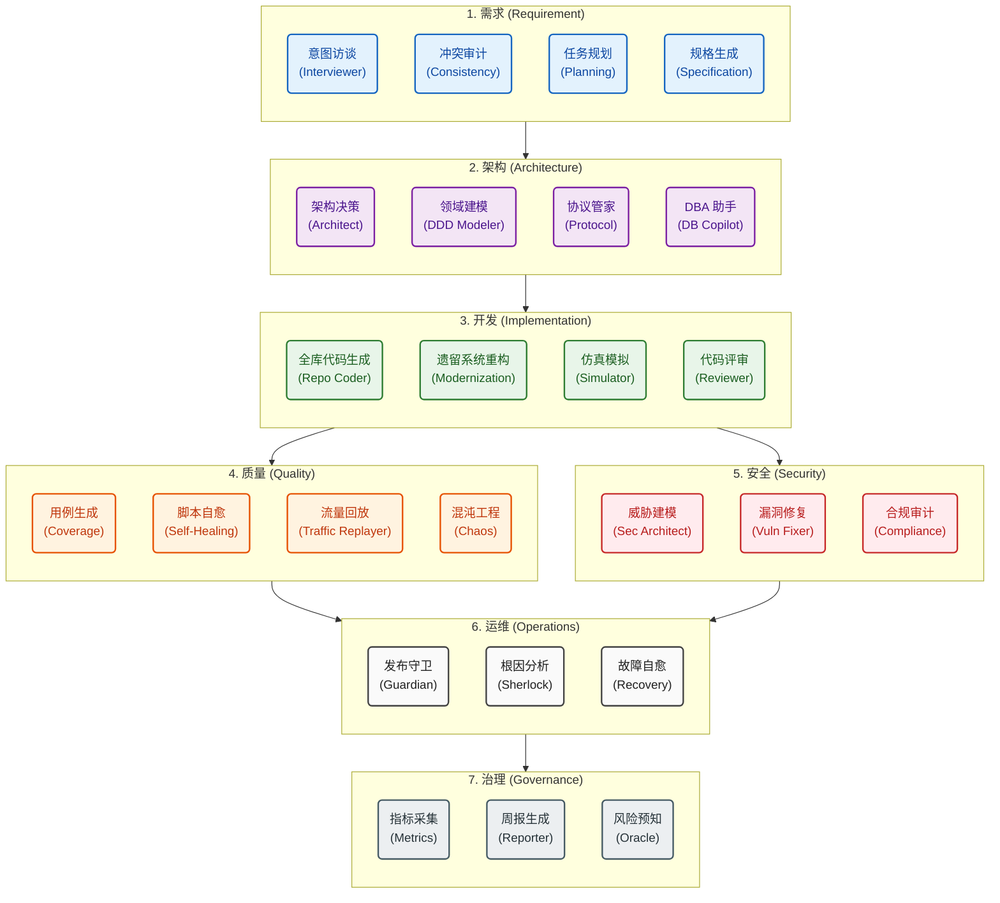
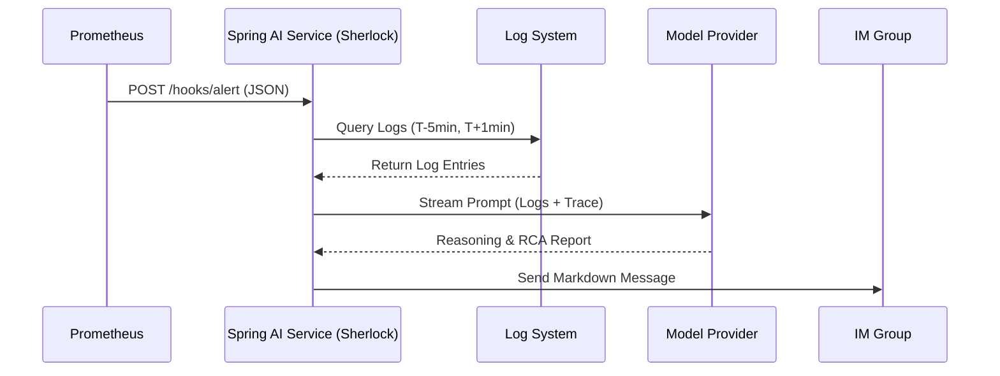

# 软件工程 3.0：Agentic SE 架构蓝图与实施指南

**软件工程 3.0 (Agentic SE)** 标志着从“人驱动工具”向“人机协同伴生”的范式转变。在这一阶段，AI Agent 不再仅仅是辅助编码的 Copilot，而是具备感知、推理、决策与执行能力的“数字员工”。本矩阵定义了 SE 3.0 体系下，全生命周期（SDLC）关键原子活动的智能化形态。

## 1. 全景概览：Agent 能力分布地图 (Capability Map)

本思维导图展示了 AI Agent 在软件工程全生命周期中的能力覆盖分布，构成了 SE 3.0 的核心骨架：



---

## 2. 需求工程 (Intent & Requirements)

| 原子活动 (Atomic Activity) | 核心任务描述 (Task Description)                        | AI Agent 协同机制 (Agent Mechanism)                                                                              |
| :------------------------- | :----------------------------------------------------- | :--------------------------------------------------------------------------------------------------------------- |
| **意图捕获与澄清**         | 识别模糊业务描述中的隐性约束与非功能性需求。           | [**Interviewer Agent**](specs/agent_interviewer.md)：采用多角色扮演（Persona）策略，通过反问与引导补全业务边界。 |
| **冲突与一致性审计**       | 检测跨项目、跨文档的业务规则逻辑矛盾与术语歧义。       | [**Consistency RAG**](specs/agent_consistency_rag.md)：基于语义向量检索，自动识别新旧需求间的逻辑冲突。          |
| **原子用户故事拆解**       | 将宏大史诗 (Epic) 分解为符合 INVEST 原则的可交付单元。 | [**Planning Agent**](specs/agent_planning.md)：基于历史交付数据与复杂度模型，启发式生成任务拆解树。              |
| **验收准则 (AC) 自动化**   | 生成可执行的 BDD/Gherkin 格式测试用例描述。            | [**Specification Agent**](specs/agent_specification.md)：将自然语言需求精准转化为 Given-When-Then 逻辑断言。     |

## 3. 系统架构与设计 (Design & Architecture)

| 原子活动 (Atomic Activity) | 核心任务描述 (Task Description)                       | AI Agent 协同机制 (Agent Mechanism)                                                                         |
| :------------------------- | :---------------------------------------------------- | :---------------------------------------------------------------------------------------------------------- |
| **架构决策推理 (ADR)**     | 针对多方案进行 Trade-off 分析（如一致性 vs 可用性）。 | [**Architect CoT**](specs/agent_architect.md)：检索架构模式库，生成基于场景的决策树与利弊分析报告。         |
| **领域模型 (DDD) 构建**    | 识别聚合根、实体、值对象及限界上下文边界。            | [**Domain Modeler**](specs/agent_domain_modeler.md)：通过代码/需求双向映射，自动提炼与可视化领域模型。      |
| **API 契约定义**           | 定义标准化接口规范（OpenAPI/IDL）及兼容性策略。       | [**Protocol Steward**](specs/agent_protocol_steward.md)：自动生成符合企业标准的接口契约，并校验向后兼容性。 |
| **数据架构演进**           | 设计符合范式的 Schema、索引策略及数据脱敏规则。       | [**DBA Copilot**](specs/agent_dba_copilot.md)：结合查询模式预测，自动推荐 DDL 变更与索引优化方案。          |

## 4. 开发实施 (Implementation)

| 原子活动 (Atomic Activity) | 核心任务描述 (Task Description)                      | AI Agent 协同机制 (Agent Mechanism)                                                                          |
| :------------------------- | :--------------------------------------------------- | :----------------------------------------------------------------------------------------------------------- |
| **逻辑合成与代码填充**     | 基于全项目上下文，自动生成业务逻辑代码与胶水代码。   | [**Repo-Aware Coder**](specs/agent_repo_coder.md)：通过 MCP 协议感知工程全局依赖，实现“一次生成，多处引用”。 |
| **遗留系统现代化**         | 将单体/旧技术栈（Label/COBOL）平滑迁移至微服务架构。 | [**Modernization Agent**](specs/agent_modernization.md)：基于 AST 的结构变换与语义保持转译，确保逻辑等价性。 |
| **动态 Mock 编排**         | 为未就绪的依赖服务构建高保真仿真环境。               | [**Simulator Agent**](specs/agent_simulator.md)：解析契约协议，动态生成具备状态记忆的 Mock 服务。            |
| **智能代码评审 (CR)**      | 审计代码异味、安全漏洞、甚至深层逻辑缺陷。           | [**Reviewer Agent**](specs/agent_reviewer.md)：融合静态分析与大模型语义理解，提供可执行的修复建议。          |

## 5. 测试与质量工程 (Quality Engineering)

| 原子活动 (Atomic Activity) | 核心任务描述 (Task Description)                | AI Agent 协同机制 (Agent Mechanism)                                                               |
| :------------------------- | :--------------------------------------------- | :------------------------------------------------------------------------------------------------ |
| **全路径用例生成**         | 构造覆盖核心路径、异常分支及边界条件的测试集。 | [**Coverage Agent**](specs/agent_coverage.md)：基于控制流图分析，自动生成高覆盖率的测试数据组合。 |
| **UI 自动化脚本自愈**      | 应对前端 DOM 变更，自动修复失效的测试脚本。    | [**Self-Healing Agent**](specs/agent_self_healing.md)：利用多模态视觉理解，动态重新定位 UI 元素。 |
| **生产流量回放**           | 录制生产流量并在预发环境回放，校验逻辑一致性。 | [**Traffic Replayer**](specs/agent_traffic_replayer.md)：智能数据脱敏与流量清洗，聚合异常差异点。 |
| **对抗性模糊测试**         | 模拟恶意攻击与异常输入，挖掘安全/稳定性边界。  | [**Chaos Agent**](specs/agent_chaos.md)：生成对抗性样本与故障注入，验证系统鲁棒性。               |

## 6. 安全与合规 (DevSecOps 3.0)

| 原子活动 (Atomic Activity) | 核心任务描述 (Task Description)                  | AI Agent 协同机制 (Agent Mechanism)                                                                                 |
| :------------------------- | :----------------------------------------------- | :------------------------------------------------------------------------------------------------------------------ |
| **威胁建模自动化**         | 在设计阶段识别数据流图中的潜在攻击面。           | [**Security Architect**](specs/agent_security_architect.md)：对标 STRIDE/MITRE ATT&CK 模型，自动标记高危链路。      |
| **漏洞自动修复 (APR)**     | 识别 CVE/SAST 漏洞并生成经过验证的修复补丁。     | [**Vulnerability Fixer**](specs/agent_vulnerability_fixer.md)：检索漏洞库与补丁知识库，自动提交修复 Pull Request。  |
| **合规性内生审计**         | 确保系统满足等保 2.0、GDPR、PCI-DSS 等准入标准。 | [**Compliance Auditor**](specs/agent_compliance_auditor.md)：将法律文本转化为 Policy-as-Code 规则，实时扫描违规项。 |

## 7. 发布、运维与观测 (SRE 3.0)

| 原子活动 (Atomic Activity) | 核心任务描述 (Task Description)            | AI Agent 协同机制 (Agent Mechanism)                                                                       |
| :------------------------- | :----------------------------------------- | :-------------------------------------------------------------------------------------------------------- |
| **智能灰度发布**           | 实时监控发布指标，自主决策流量比例或回滚。 | [**Release Guardian**](specs/agent_release_guardian.md)：基于 DORA 指标与异常检测算法的无人值守发布引擎。 |
| **根因诊断 (RCA)**         | 在海量告警中定位故障源头，分析传播链路。   | [**Sherlock Agent**](specs/agent_sherlock.md)：构建故障知识图谱，自动关联日志、Metric 与变更事件。        |
| **故障自愈执行**           | 执行标准化的恢复预案（重启、扩容、降级）。 | [**Recovery Bot**](specs/agent_recovery_bot.md)：在授权范围内，自动调用运维工具链执行止损操作。           |

## 8. 效能治理与度量 (Governance)

| 原子活动 (Atomic Activity) | 核心任务描述 (Task Description)        | AI Agent 协同机制 (Agent Mechanism)                                                                            |
| :------------------------- | :------------------------------------- | :------------------------------------------------------------------------------------------------------------- |
| **DORA 指标自动核算**      | 无感采集并计算研发效能核心指标。       | [**Metrics Collector**](specs/agent_metrics_collector.md)：聚合跨工具链（Git/Jira/CI）数据，实时生成效能看板。 |
| **智能周报合成**           | 从碎片化工作记录中提炼高价值工作摘要。 | [**Reporter Agent**](specs/agent_reporter.md)：语义压缩 Git Commit 与工单记录，生成结构化汇报材料。            |
| **项目风险预警**           | 预测交付延期、质量下滑等潜在风险。     | [**Oracle Agent**](specs/agent_oracle.md)：基于时间序列分析与情感分析，提前识别项目“亚健康”状态。              |

---

## 9. 底层基石 (Infrastructure Foundations)

为支撑上述原子活动的智能化，必须构建以下三大基础设施：

1. **MCP (Model Context Protocol)**：
   - **定义**：Agent 与企业数字环境（IDE, Git, Cloud, DB）的标准交互协议。
   - **价值**：赋予 Agent “手”和“眼”，使其能读取实时状态并执行物理操作。

2. **Repo-level Semantics (Code Graph)**：
   - **定义**：基于 AST 与语义向量构建的代码知识图谱。
   - **价值**：提供跨文件、跨仓库的深层语义理解，确保 AI 不会产生“幻觉”。

3. **Human-in-the-loop (HITL) Protocol**：
   - **定义**：关键决策节点的“人机握手”机制。
   - **价值**：在自动化与可控性之间取得平衡，对高风险操作（删除数据、资金交易）实施授权熔断。

## 10. 实施框架：双模运行时架构 (Dual-Runtime Architecture)

为满足“本地代码深度开发”与“企业存量系统集成”的双重需求，我们采用 **双模运行时 (Dual-Runtime)** 策略。

### 10.1 核心架构设计

我们定义了两种截然不同但互联互通的 Agent 运行时环境，并辅以横向的安全与审计层：

| 运行时类型   | **客户端运行时 (Client-Side)**                                                           | **服务端运行时 (Server-Side)**                        |
| :----------- | :--------------------------------------------------------------------------------------- | :---------------------------------------------------- |
| **核心载体** | **[Claude Code (CLI)](https://docs.anthropic.com/en/docs/agents-and-tools/claude-code)** | **[Spring AI](https://spring.io/projects/spring-ai)** |
| **部署位置** | 开发者本地终端 (Localhost)                                                               | 企业 Kubernetes / 私有云环境                          |
| **模型支持** | **Cloud / Private LLM (via Proxy)**                                                      | **Local LLM (DeepSeek, Qwen via Ollama)**             |
| **核心职责** | 代码重构、调试、本地构建、TDD 循环                                                       | 流水线编排、OA 审批、IM 交互、日志巡检                |
| **合规特性** | **支持纯内网运行 (Air-gapped)**                                                          | **Data Residency (数据不出境), Audit Logs**           |

> **安全与审计 (Safety & Audit Layer)**:
> 所有 Agent 交互均受控于全局护栏 (Guardrails)，不仅校验输入输出的安全性（防注入），更强制记录完整的 CoT 推理链路以备监管审计。

---

### 10.2 客户端运行时：Claude Code as Agent Runtime

本节阐述通过 **Claude Code (CLI)** 实现本地开发闭环的标准作业程序 (SOP)。

### 10.2.1 架构原理 (Architecture)

我们将 AI Agent 解构为三个正交的维度：

- **Host (宿主)**: `Claude Code CLI`
  - 提供运行时环境，具备文件系统读写、终端命令执行、MCP 协议调用等原生能力。
- **Persona (灵魂)**: `System Prompts` (`.agent/roles/*.md`)
  - 定义 Agent 的专业角色、思维模型 (CoT)、行为边界与输出格式。
- **Context (感知)**: `Project Workspace`
  - **静态感知**: 本地文件 (`src/`, `docs/`)。
  - **动态感知**: 终端管道输入 (`stdin`)、运行时日志 (`logs/`)。

### 10.2.2 核心方法论 (Methodology)

1. **Agents as Unix Tools**
   - 遵循 Unix 哲学："Do one thing and do it well."
   - Agent 不应是庞大的单体应用，而应是轻量级、可组合的 CLI 工具。
2. **Text Streams as Interface**
   - Agent 之间通过标准文本流进行交互。
   - Example: `git diff | reviewer-agent | json-parser`
3. **In-Context Learning**
   - 不依赖微调 (Fine-tuning)，通过长上下文窗口加载项目规范 (`docs/standards/`) 实现“入模即用”。

### 10.2.3 标准化使用模式 (Usage Patterns)

#### 模式 A: 交互式会话 (The Consultant)

````

#### 模式 B: 精准指令 (The Solider)

适用于目标明确的生成任务。

```bash
claude -p .agent/roles/repo_coder.md "请基于 docs/api.yaml 实现 UserController"
````

#### 模式 C: 管道过滤器 (The Filter)

适用于代码评审、日志分析、数据处理。

```bash
# Code Review
git diff --staged | claude -p .agent/roles/reviewer.md

# Log Analysis
tail -n 200 app.log | claude -p .agent/roles/sherlock.md
```

### 10.2.4 企业级 AI 网关集成 (Enterprise AI Gateway Integration)

Claude Code CLI 支持通过覆盖 API 端点的方式连接企业内部的统一 AI 网关（如 LiteLLM, APISIX AI Gateway）。这不仅实现了**数据完全不出境**，还能复用网关提供的鉴权、审计与流控能力。

```bash
# 配置 Claude CLI 连接内部 DeepSeek/Qwen 服务
export ANTHROPIC_BASE_URL="http://internal-ai-gateway.bank-intranet.com/v1"
export ANTHROPIC_API_KEY="sk-internal-token"

# 启动 CLI (流量将完全在内网流转)
claude
```

### 10.3 服务端运行时：Spring AI Integration

针对企业存量系统（BizDevOps、OA、IM），采用 **Spring AI** 作为无头（Headless）Agent 的承载容器。

#### 10.3.1 核心价值 (Core Value Proposition)

相比于 LangChain (Python) 或 Dify (Low-Code)，**Spring AI** 在企业级 Java 环境中具有压倒性优势：

1. **原生生态**: 直接复用企业现有的 Service 层、DAO 层和安全配置（Spring Security），Agent 仅仅是另一个 `@Service`。
2. **事务一致性**: 利用 Spring 的 `@Transactional` 机制，确保 Agent 执行的数据库操作（如审批状态更新）具备 ACID 特性。
3. **数据合规**: 天然支持 **Ollama** 本地部署方案，通过 OpenAI 兼容协议无缝对接 **DeepSeek**、**Qwen** 等国产模型，实现**数据不出域**。
4. **全链路审计**: 集成 Micrometer/Prometheus 监控 Token 消耗，并利用 AOP 实现 CoT 推理过程的完整留痕。

#### 10.3.2 典型应用场景

- **智能审批助手**: 监听 OA 流程 -> 解析附件 -> 自动审批低风险工单。
- **研发效能机器人**: 集成 Jira/GitLab API -> 自动生成周报 -> 推送 IM 消息。

### 10.4 持续迭代与优化 (Continuous Evolution)

Agent 的能力并非一成不变，需要通过 **Agent Ops** 持续迭代：

1. **Bad Case 捕获**:
   - 当 Agent 输出不符合预期时，保存当前的 Conversation Context。
2. **Prompt Refinement**:
   - 分析失效原因（如：没理解业务术语、忽略了文件格式）。
   - 更新对应 `.agent/roles/*.md` 中的 "Anti-Patterns" 或 "Examples" 章节。
3. **Few-Shot 增强**:
   - 将优秀的人工代码或决策范例作为样本注入 Prompt，固化最佳实践。

### 10.5 可行性与局限性分析 (Feasibility & Limitations)

基于当前大模型能力与工程实践的核实：

1. **技术可行性 (Viability)**:
   - **Unix Pipe 支持**: Claude Code CLI 原生支持 `stdin` 读取，能够与 `git`, `grep`, `jq` 等标准工具无缝组合。
   - **Agentic Capability**: 这里的 Operator 模式已在 GitHub Copilot CLI 和开源工具 (如 `aider`) 中得到验证。

2. **性能约束 (Constraints)**:
   - **延迟 (Latency)**: 相比传统 lint 工具 (ms级)，LLM 调用通常在秒级 (3-10s)。因此适合 _异步_ (Code Review) 或 _低频高价值_ (Architecture Design) 场景，而非实时语法检查。
   - **上下文 (Context)**: 全仓库理解仍受限于 Context Window (如 200k tokens)。需依赖 RAG 或文件摘要 (File Summary) 进行“有损压缩”。

3. **安全风险 (Risks)**:
   - **Prompt Injection**: 当处理外部不受信数据（如用户评论）时，需防范注入攻击。

## 11. 平台集成方案 (Platform Integration Strategy)

将 **Claude Code CLI** 集成到现有的企业级研发管理系统（DevOps, Observability）中，建议采用以下三种标准模式：

### 11.1 集成评估与模式 (Evaluation & Patterns)

| 模式 (Pattern)           | 适用场景     | 架构描述                                              | 典型用例                             |
| :----------------------- | :----------- | :---------------------------------------------------- | :----------------------------------- |
| **A. Runner 模式**       | CI/CD 流水线 | 将 Claude CLI 视为一种 Build Step，在临时容器中执行。 | Code Review, Security Scan, Test Gen |
| **B. Event-Bridge 模式** | 监控/ChatOps | 告警/事件触发 Webhook -> 中间件调用 CLI -> 推送 IM。  | 故障诊断 (RCA), 自动On-call 响应     |
| **C. Service-Mesh 模式** | 内部服务调用 | 封装 CLI 为 HTTP Sidecar，作为常驻服务提供 API。      | 内部 IDE 插件后端, 知识库问答        |

### 11.2 DevOps 系统集成方案 (Integrate with CI/CD)

**目标**: 在代码合并前 (Pre-merge) 自动阻断低质量代码与安全风险。

**实施方案**:

1. **Docker 镜像化**: 构建包含 `claude` CLI 及项目依赖（如 Python, Node）的基础镜像。
2. **Pipeline 编排**: 在 GitLab CI / Jenkinsfile 中增加 `agent-check` 阶段。

**Example: GitLab CI (`.gitlab-ci.yml`)**

```yaml
stages:
  - test
  - agent-check

# 智能代码评审 Agent
agent-reviewer:
  stage: agent-check
  image: my-registry/claude-cli:latest
  script:
    - export CLAUDE_API_KEY=$CI_CLAUDE_KEY
    # 获取变更集，管道传输给 Agent
    - git diff origin/main...HEAD | claude -p .agent/roles/reviewer.md > review_report.md
    # 如果发现 Critical 问题，非零退出以阻塞流水线
    - grep -q "Critical" review_report.md && exit 1 || exit 0
  artifacts:
    paths: [review_report.md]
  only: [merge_requests]

# 安全架构扫描 Agent
agent-security:
  stage: agent-check
  script:
    # 针对全量代码进行特定规则的扫描
    - claude -p .agent/roles/security_architect.md --dangerously-skip-permissions
```

### 11.3 可观测平台集成方案 (Integrate with Observability)

**目标**: 将被动的“告警通知”转变为主动的“根因分析报告”。此场景由 **Server-Side Runtime (Spring AI)** 主导。

**实施方案**:

**实施方案**:

1. **Spring Boot Starter**: 部署 `Sherlock-Service`，引入 `spring-ai-starter-anthropic` 和 `spring-boot-starter-web`。
2. **Webhook Controller**: 暴露 REST 接口接收 AlertManager/Zabbix 的 JSON Payload。
3. **Context Retrieval**: 服务内部通过 `RestTemplate` 或 `MCP Client` 调用日志系统 (ELK/SLS) 拉取告警上下文。
4. **Agent 推理**: 注入 `ChatClient`，加载 `Sherlock` 的 System Prompt 进行根因分析。
5. **IM 推送**: 调用钉钉/飞书 SDK 将 Markdown 报告推送到运维群。

**架构流图 (Flow)**:



## 12. 投资回报率基准 (ROI Benchmark)

基于 Gartner、McKinsey 及 Forrester 2024-2025 的行业研究数据，实施 Agentic SE 3.0 体系的预期收益如下：

| 核心领域           | 对应 Agent              | 传统痛点 (Baseline)                           | AI 赋能后收益 (Projected Gains)                                                       | 行业参考数据                                          |
| :----------------- | :---------------------- | :-------------------------------------------- | :------------------------------------------------------------------------------------ | :---------------------------------------------------- |
| **遗留系统现代化** | **Modernization Agent** | 依赖高昂的人力外包，周期长且风险不可控。      | **成本降低 30-50%**<br>通过 AST 转换自动化 80% 代码转译，仅需人工验证核心逻辑。       | McKinsey: GenAI 可缩短 25-60% 的迁移项目周期。        |
| **编码与实现**     | **Repo Coder**          | 开发者 40% 时间浪费在检索文档与胶水代码上。   | **通过率提升 25-45%**<br>“一次生成，多处引用”减少上下文切换，聚焦核心业务逻辑。       | Gartner: 到 2028 年，90% 工程师将使用 AI 助手。       |
| **代码评审与质量** | **Reviewer Agent**      | 人工 Review 覆盖率低，平均流转耗时 >24 小时。 | **评审周期缩短至 <5 分钟**<br>实现 100% 全量静态扫描，拦截 70% 常见坏味道与安全漏洞。 | Graphite: 自动化评审可降低 85% 的每千行代码检查成本。 |
| **运维与根因分析** | **Sherlock Agent**      | 故障排查依赖“专家经验”，MTTR 平均 >1 小时。   | **MTTR 降低 60%**<br>分钟级生成根因报告，自动化关联 Log/Metric/Trace。                | PagerDuty: AIOps 可减少 40% 的非计划停机时间。        |

> **关键结论**: 引入 Agentic SE 不仅是效率工具的升级，更是研发成本结构的重塑。对于千人级研发团队，预计每年可释放 **20% 以上的研发效能** 用于业务创新。

## 附录：Agent 规格说明书 (Appendix: Agent Specs)

- [Agent Architect](specs/agent_architect.md)
- [Agent Chaos](specs/agent_chaos.md)
- [Agent Compliance Auditor](specs/agent_compliance_auditor.md)
- [Agent Consistency RAG](specs/agent_consistency_rag.md)
- [Agent Coverage](specs/agent_coverage.md)
- [Agent DBA Copilot](specs/agent_dba_copilot.md)
- [Agent Domain Modeler](specs/agent_domain_modeler.md)
- [Agent Interviewer](specs/agent_interviewer.md)
- [Agent Metrics Collector](specs/agent_metrics_collector.md)
- [Agent Modernization](specs/agent_modernization.md)
- [Agent Oracle](specs/agent_oracle.md)
- [Agent Planning](specs/agent_planning.md)
- [Agent Protocol Steward](specs/agent_protocol_steward.md)
- [Agent Recovery Bot](specs/agent_recovery_bot.md)
- [Agent Release Guardian](specs/agent_release_guardian.md)
- [Agent Repo Coder](specs/agent_repo_coder.md)
- [Agent Reporter](specs/agent_reporter.md)
- [Agent Reviewer](specs/agent_reviewer.md)
- [Agent Security Architect](specs/agent_security_architect.md)
- [Agent Self Healing](specs/agent_self_healing.md)
- [Agent Sherlock](specs/agent_sherlock.md)
- [Agent Simulator](specs/agent_simulator.md)
- [Agent Specification](specs/agent_specification.md)
- [Agent Traffic Replayer](specs/agent_traffic_replayer.md)
- [Agent Vulnerability Fixer](specs/agent_vulnerability_fixer.md)
