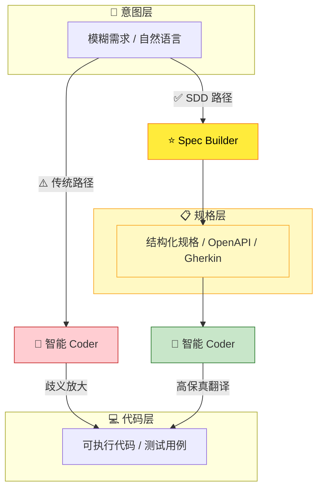
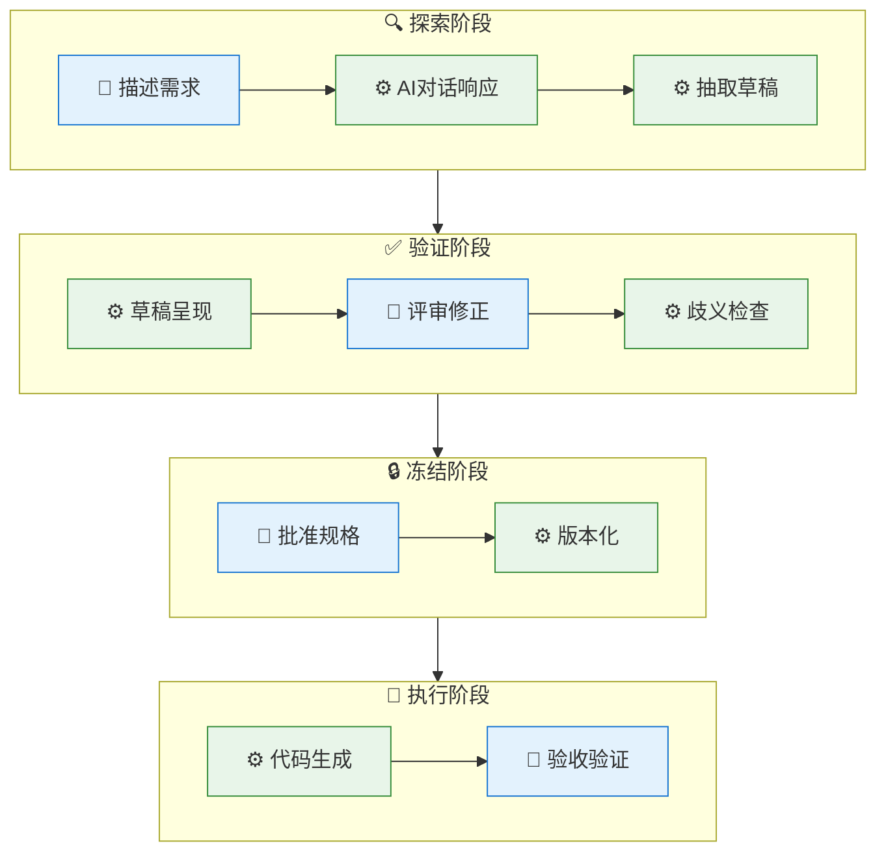
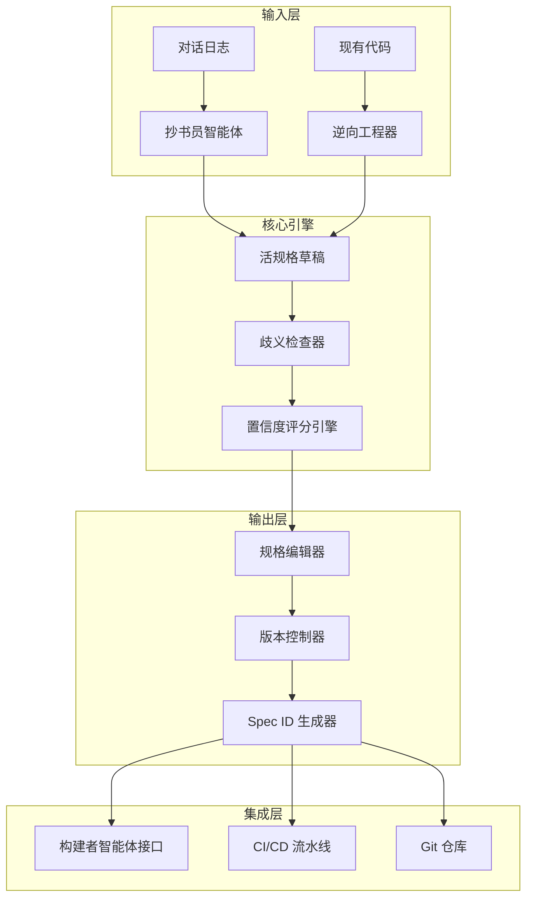
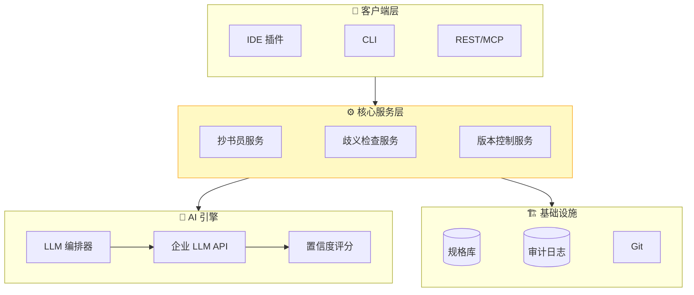

# 📋 Spec Builder - 产品需求文档 (PRD)

**版本**: 1.0  
**状态**: Draft  
**创建日期**: 2025-12-22  
**文档所有者**: SparkForge Team

---

## 1. 执行摘要

### 1.1 产品愿景

**Spec Builder** 是一款专为 **规格驱动开发 (SDD)** 范式设计的**轻量级规格构建工具**。它不是重型 IDE，而是可嵌入现有开发环境（VSCode 扩展、CLI、DevOps 流水线）的智能组件。其核心使命是：

> **将「规格税」降至与「对话驱动调试税」相当的水平，将规格撰写从手工负担转变为半自动化的验证任务。**

在 LLM 辅助研发的新时代，软件工程的瓶颈已从**代码生成**转向**意图对齐**。Spec Builder 旨在成为人与 AI 之间的**高保真意图传输层**，让开发者专注于「做什么」和「为何做」，而将「如何做」委托给 AI 执行引擎。

### 1.2 产品定位

**核心洞察**：2025 年，Cursor/Copilot/Aider 等主流 AI 编码工具在功能上日趋同质化（均具备补全、生成、Agent 能力）。**真正的效率瓶颈不在「代码生成」，而在「意图对齐」**。

Spec Builder 定位于 AI 编程工作流的**上游规格层**，而非与现有工具竞争代码层：



**图示说明**：

- 🔴 **传统路径**：智能 Coder 直接消费自然语言 → 歧义放大、返工频繁
- 🟢 **SDD 路径**：Spec Builder 先将意图结构化 → 智能 Coder 消费**结构化规格** → 高保真翻译

**与现有工具的关系**：Spec Builder **不替代**智能 Coder（Cursor/Copilot/Aider 等），而是作为其**上游输入源**——以 VSCode 扩展、CLI 或 API 形式嵌入现有工作流，输出的 Spec ID 可被下游工具消费。

### 1.3 核心价值主张

| 痛点                               | Spec Builder 解决方案                    |
| :--------------------------------- | :--------------------------------------- |
| 对话漂移：LLM 在长对话中丢失上下文 | 将对话实时结晶为**活规格文档**           |
| 意图不对齐：AI 生成"不是我要的"    | 提供**歧义检查器**，在编码前拦截模糊需求 |
| 规格成本高：手写规格耗时且抵触     | **抄书员智能体**自动从对话中提取规格草稿 |
| 规格与代码脱节：文档更新滞后       | **双向同步**机制，确保代码与规格一致     |

---

## 2. 目标用户分析

### 2.1 用户画像

#### 主要用户：技术架构师 / 高级开发者

```yaml
Persona: "Alex - 技术架构师"
  背景:
    - 10年软件开发经验，3年团队管理
    - 负责系统设计与技术决策
    - 日常使用 VSCode/IntelliJ + AI 编码助手
  痛点:
    - 需求讨论后，规格文档总是延迟交付
    - 团队成员对需求理解不一致，返工频繁
    - AI 生成的代码经常"偏离轨道"，需大量人工调试
  期望:
    - 需求对话后自动生成 80% 的规格草稿
    - 规格中的歧义被自动高亮并提供修复建议
    - 规格变更自动触发代码适配提醒
```

#### 次要用户：产品经理 / 业务分析师

```yaml
Persona: "Lisa - 产品经理"
  背景:
    - 5年产品管理经验
    - 精通业务领域，但技术知识有限
    - 经常与开发团队进行需求沟通
  痛点:
    - 技术术语难以准确表达
    - 需求被开发"曲解"后才发现问题
    - 难以追踪需求从定义到实现的全过程
  期望:
    - 用自然语言描述需求，系统自动转化为技术规格
    - 能直观看到规格与代码的关联
    - 规格变更历史可追溯
```

### 2.2 用户旅程图



**图例**：🟦 👤 **人类操作** | 🟩 ⚙️ **系统自动化**（含 AI 智能体）

---

## 3. 功能需求规格

### 3.1 功能架构概览



### 3.2 MVP 功能集 (V1)

#### 3.2.1 🤖 抄书员智能体（Scribe Agent）

**功能描述**：  
分析需求对话历史，自动抽取结构化规格草稿。

**用户故事**：

| ID    | 用户故事                                                             | 验收标准                                 | 优先级 |
| :---- | :------------------------------------------------------------------- | :--------------------------------------- | :----- |
| US-01 | 作为架构师，我希望点击「生成规格」后，系统能基于对话历史生成规格草稿 | 30分钟对话 → 10分钟内生成 80% 覆盖率草稿 | P0     |
| US-02 | 作为架构师，我希望草稿以 Markdown/YAML 格式呈现，便于评审            | 输出格式符合最小定义（接口 + 验收标准）  | P0     |
| US-03 | 作为架构师，我希望草稿中低置信度区域被自动高亮                       | 每个抽取实体附带置信度评分 (0-1)         | P0     |
| US-04 | 作为架构师，我希望能一键接受/拒绝建议修改                            | 提供行内差异对比 + 批量操作              | P1     |

**置信度评分维度**：上下文支持度 (40%)、歧义程度 (30%)、完整性 (30%)

---

#### 3.2.2 🔍 歧义检查器（Ambiguity Linter）

**功能描述**：  
静态分析规格文档，识别模糊术语、缺失验收标准等问题。

**用户故事**：

| ID    | 用户故事                                                         | 验收标准                       | 优先级 |
| :---- | :--------------------------------------------------------------- | :----------------------------- | :----- |
| US-05 | 作为架构师，我希望系统自动标记模糊术语（如「快速」「用户友好」） | 检测率 > 85%（基于黄金测试集） | P0     |
| US-06 | 作为架构师，我希望系统为模糊术语提供精确替代建议                 | 每个标记附带至少1条可量化建议  | P0     |
| US-07 | 作为架构师，我希望在保存规格时自动运行检查                       | 保存触发检查，阻塞冻结操作     | P1     |

**检测规则类型**：模糊形容词、缺失验收标准、未定义实体引用、矛盾约束等

---

#### 3.2.3 📦 一键版本化（One-Click Versioning）

**功能描述**：  
将规格草稿冻结为正式版本，生成唯一 Spec ID，提交至 Git。

**用户故事**：

| ID    | 用户故事                                             | 验收标准                                 | 优先级 |
| :---- | :--------------------------------------------------- | :--------------------------------------- | :----- |
| US-08 | 作为架构师，我希望点击「冻结」后，规格被快照并版本化 | 生成 `spec/<module>/<version>.yaml` 文件 | P0     |
| US-09 | 作为架构师，我希望每个冻结版本有唯一 Spec ID         | ID 格式：`SPEC-<module>-<semver>-<hash>` | P0     |
| US-10 | 作为架构师，我希望冻结操作自动提交至 Git             | 自动创建带标准 commit message 的 commit  | P1     |
| US-11 | 作为架构师，我希望在冻结前必须通过歧义检查           | 检查未通过时，冻结按钮禁用               | P0     |

**Spec ID 格式**：`SPEC-{MODULE}-{SEMVER}-{HASH}`，如 `SPEC-auth-1.0.0-a1b2c3d4`

---

#### 3.2.4 🔄 逆向工程器（Reverse Engineer）

**功能描述**：  
从现有代码中自动提取规格草稿，实现「代码 → 规格」的反向映射。

**用户故事**：

| ID    | 用户故事                                               | 验收标准                     | 优先级 |
| :---- | :----------------------------------------------------- | :--------------------------- | :----- |
| US-12 | 作为架构师，我希望从现有 API 代码生成 OpenAPI 规格草稿 | 支持 Java/Go/Python 主流框架 | P1     |
| US-13 | 作为架构师，我希望从数据库 Schema 生成实体规格         | 支持 PostgreSQL/MySQL DDL    | P2     |
| US-14 | 作为架构师，我希望生成的规格与现有规格进行差异对比     | 高亮不一致之处，建议同步方向 | P1     |

---

### 3.3 延后功能 (V2 及以后)

| 功能                 | 说明                                   | 门控条件                     |
| :------------------- | :------------------------------------- | :--------------------------- |
| **实时抽取**         | 对话过程中后台实时监听并抽取实体       | V1 用户反馈 + 技术可行性评估 |
| **双向同步**         | 代码变更时，规格自动更新或触发告警     | 逆向工程器成熟度             |
| **规格覆盖率仪表盘** | 可视化展示 Spec-Verified-Lines-of-Code | MVP 上线后的数据积累         |
| **多智能体协作**     | 抄书员 + 构建者 + 测试员智能体协同工作 | 单智能体能力验证             |

---

## 4. 非功能需求

### 4.1 性能需求

| 指标             | 目标值                      | 测量方法 |
| :--------------- | :-------------------------- | :------- |
| 规格综合响应时间 | 30分钟对话 → < 60s 生成草稿 | P95 延迟 |
| 歧义检查响应时间 | < 2s（1000行规格文档）      | P95 延迟 |
| 版本化操作时间   | < 5s（含 Git 提交）         | P95 延迟 |
| 并发用户支持     | ≥ 50 用户同时使用           | 负载测试 |

### 4.2 可用性需求

| 需求           | 描述                                           |
| :------------- | :--------------------------------------------- |
| 零陡峭学习曲线 | 熟悉 VSCode 的开发者应在 15 分钟内上手核心功能 |
| 键盘优先       | 所有核心操作支持键盘快捷键                     |
| 暗色模式       | 支持浅色/暗色主题切换                          |
| 国际化         | 首发支持中文/英文界面                          |

### 4.3 集成需求（嵌入式部署）

Spec Builder 设计为**可嵌入组件**，支持多种部署形态：

| 部署形态      | 说明                                                                                | 优先级 |
| :------------ | :---------------------------------------------------------------------------------- | :----- |
| IDE 插件      | 深度集成 VSCode / IntelliJ IDEA，提供侧边栏 + 命令面板                              | P0     |
| CLI / CI 集成 | 命令行工具，支持脚本调用及企业 CI 流水线（Jenkins/Gitee CI），MR 中自动评审规格变更 | P0     |
| REST API      | 供第三方工具调用                                                                    | P1     |
| MCP Server    | 遵循 Model Context Protocol，供 灵码/Claude Code 等 AI 工具原生调用                 | P1     |
| Git Hook      | 提交前自动校验规格完整性                                                            | P1     |

### 4.4 安全与合规需求

| 需求       | 描述                                     |
| :--------- | :--------------------------------------- |
| 数据本地化 | 规格数据优先存储在本地，可选同步至私有云 |
| 对话脱敏   | 发送至 LLM 的对话内容支持自动脱敏处理    |
| 审计日志   | 所有规格变更操作记录完整审计轨迹         |
| 企业 SSO   | 支持 OIDC/SAML 单点登录                  |

---

## 5. 技术架构

### 5.1 系统架构图



**数据流说明**：客户端 → 核心服务 → AI 引擎 / 基础设施

### 5.2 技术选型

| 部署形态 / 层级   | 技术选型                                   | 理由                           |
| :---------------- | :----------------------------------------- | :----------------------------- |
| **IDE 插件**      | VSCode: TypeScript + Webview; IDEA: Kotlin | 原生扩展开发体验               |
| **CLI / CI 集成** | Go (Cobra)                                 | 跨平台、单二进制、易于 CI 集成 |
| **REST API**      | Java (Spring Boot)                         | 企业技术栈统一，团队熟练度高   |
| **MCP Server**    | TypeScript (官方 SDK)                      | 遵循 MCP 协议规范              |
| **Git Hook**      | Shell + CLI 调用                           | 轻量、无依赖                   |
| **LLM 编排**      | Spring AI / LangChain4j                    | Java 原生 AI 框架，企业友好    |
| **规格存储**      | SQLite (本地) / OceanBase (云)             | 轻量与企业级兼顾               |
| **实时通信**      | WebSocket / SSE                            | 流式输出支持                   |

### 5.3 核心 API 端点

| 端点                        | 方法 | 功能               |
| :-------------------------- | :--- | :----------------- |
| `/api/v1/scribe/synthesize` | POST | 从对话生成规格草稿 |
| `/api/v1/lint/check`        | POST | 歧义检查           |
| `/api/v1/spec/freeze`       | POST | 冻结规格并版本化   |
| `/api/v1/spec/{id}`         | GET  | 获取指定版本规格   |

---

## 6. 成功指标

### 6.1 业务指标

| 维度       | 指标                                               | 目标值    | 测量周期 |
| :--------- | :------------------------------------------------- | :-------- | :------- |
| **效率**   | 30分钟复杂需求会话 → 规格草稿生成 + 用户修订总时间 | < 10 分钟 | 每次使用 |
| **采纳**   | 开发者倾向「评审草稿」而非「从头撰写」的比例       | > 90%     | 季度问卷 |
| **质量**   | 规格草稿准确率（与专家黄金规格对比）               | > 90%     | 每版本   |
| **满意度** | 用户 NPS（净推荐值）                               | > 40      | 季度问卷 |

### 6.2 技术指标

| 指标                                         | 目标值  |
| :------------------------------------------- | :------ |
| 歧义识别率                                   | > 85%   |
| 结构完整性（符合最小定义的规格比例）         | > 95%   |
| 首次通过率（AI生成代码无需人工干预通过测试） | > 85%   |
| 系统可用性                                   | > 99.5% |

### 6.3 成本指标

| 指标                        | 目标值   |
| :-------------------------- | :------- |
| MVP 开发周期                | ≤ 3 人月 |
| 年度维护成本占开发成本比例  | < 20%    |
| 单次规格综合 LLM Token 成本 | < ¥0.5   |

---

## 7. 风险与缓解

### 7.1 风险矩阵

| 风险                     | 概率 | 影响 | 缓解策略                                  |
| :----------------------- | :--- | :--- | :---------------------------------------- |
| 抄书员智能体准确率不达标 | 中   | 高   | 阶段零门控；降级为仅提供检查器 + 逆向工程 |
| 用户抵触规格撰写         | 中   | 中   | 强调「评审草稿」体验；提供渐进式采纳路径  |
| LLM API 成本过高         | 低   | 中   | 优化 Prompt；支持本地模型；Token 缓存     |
| 与现有工作流冲突         | 中   | 中   | 提供灵活的集成点；支持可选启用            |
| 规格与代码同步困难       | 高   | 中   | V1 先做单向（规格→代码）；V2 再做双向     |

### 7.2 门控条件

根据 **渐进式证据收集方案**，MVP 开发受以下门控条件约束：

| 阶段     | 通过后行动     | 未通过后行动                            |
| :------- | :------------- | :-------------------------------------- |
| 阶段零   | 继续阶段 A     | 终止抄书员智能体，聚焦检查器 + 逆向工程 |
| 阶段 A+B | 启动 MVP 开发  | 重新评估 SDD 范式可行性                 |
| 阶段 C   | 制定 V2 路线图 | 缩减范围或延后推广                      |

---

## 8. 附录：术语表

| 术语             | 定义                                    |
| :--------------- | :-------------------------------------- |
| **SDD**          | Spec-Driven Development，规格驱动开发   |
| **CDD**          | Chat-Driven Development，对话驱动开发   |
| **规格税**       | 撰写与维护规格的成本                    |
| **活规格**       | 动态演进、与代码保持同步的规格文档      |
| **抄书员智能体** | 负责从对话中抽取规格的 AI Agent         |
| **构建者智能体** | 负责基于规格生成代码的 AI Agent         |
| **歧义检查器**   | 识别规格中模糊表述的静态分析工具        |
| **Spec ID**      | 冻结规格的唯一标识符                    |
| **RTCR**         | Relative Total Cost Ratio，相对总成本比 |

---

> 🎯 **本 PRD 的成功标准**：当开发者说「我宁愿评审 AI 生成的规格草稿，也不愿自己从头写」时，Spec Builder 就实现了它的核心价值。
