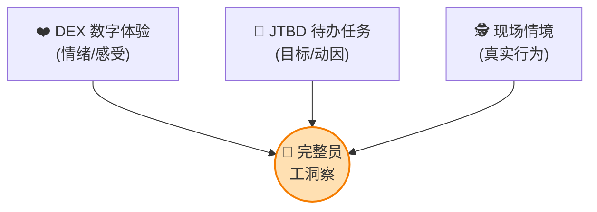
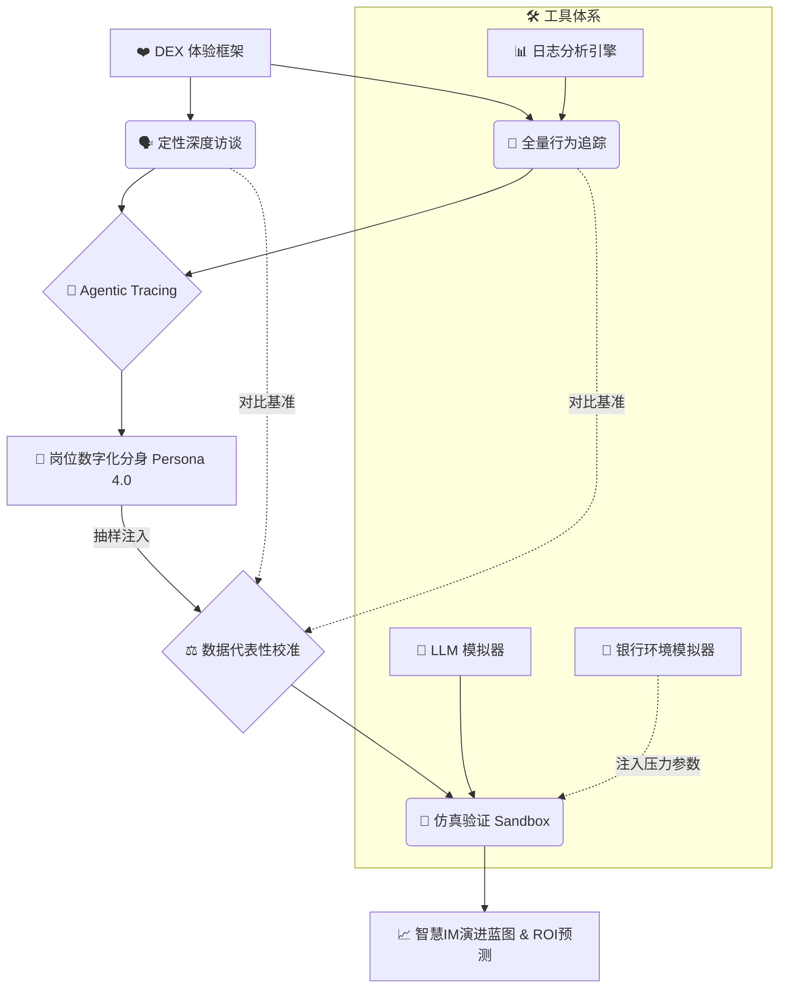
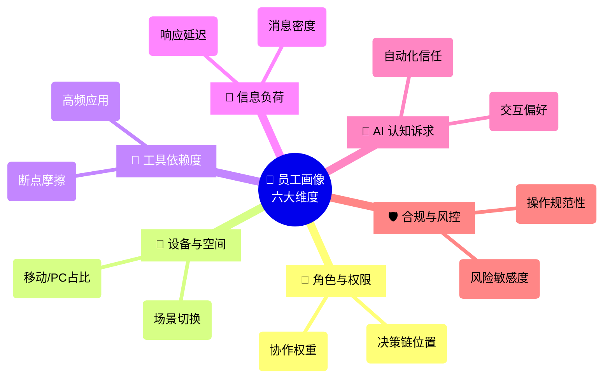
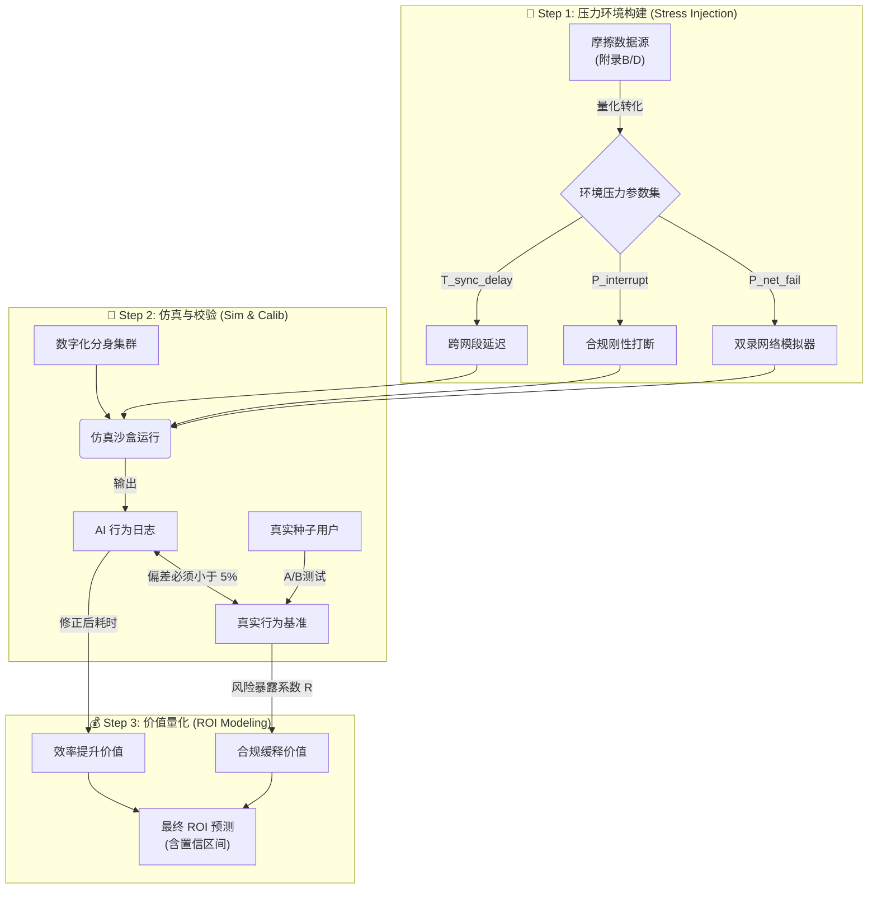

# 📘 企业智慧IM及移动办公门户员工画像调研方法论报告

## 一、🌍 调研背景与目标

随着企业数字化转型进入AI原生阶段，企业IM已演变为集沟通、协作、业务流转于一体的“移动办公门户”。本次调研旨在通过全方位、多维度的员工行为刻画，识别各岗位、各层级在移动端办公中的痛点，为AI能力的精准植入（如智能助手、自动化工作流、知识萃取等）提供底层逻辑支撑。

## 二、🧠 核心调研方法论

报告采用 DEX（数字员工体验）框架为核心，结合 JTBD（待办任务理论）与情境调查法，构建**以JTBD为内核、以DEX为度量、以情境调查为验证的立体调研体系**。

### 2.1 ❤️ 数字员工体验模型 (DEX)

不仅关注功能可用性，更关注员工在移动门户中的情绪体验、交互顺畅度及任务达成率。

### 2.2 🔨 待办任务理论 (JTBD)

不以功能为中心，而以“任务目标”为中心。深入探究员工“雇佣”移动门户是为了完成什么业务目标（如：在通勤时快速决策、在现场快速录入数据）。

### 2.3 🕵️ 情境调查与行为日志分析

通过后台埋点数据（定量）与现场观察（定性）的交叉验证，还原真实的移动办公场景。

### 2.4 🤖 智能体化路径分析 (Agentic Tracing)

- **核心定义 [AI-Native 增强]：** 利用 AI 对脱敏的系统日志进行自动化还原，识别“人机重劳”点（即重复性高、消耗大的非生产性操作），并模拟 AI Agent 代运营后的收益率，将调研从“现状描述”升级为“提效预测”。
- **前置过滤 (Compliance Rules Pre-screening)：** 在AI进行自动化还原前，必须首先调用预定义的‘合规任务规则库’。该规则库基于[附录B](#appendix-b)的银行专项场景及核心监管要求，明确定义了‘不可豁免的合规节点’（如：双录环境检测、风险条款逐条宣读、尽调GPS定位等）。AI在识别‘人机重劳’点时，必须自动排除这些节点，或将其标记为‘受保护状态’，不进入后续的优化建议池。
- **后置验证 (Human-AI Cross-Validation)：** 为确保AI还原路径的真实性与合规性，必须执行‘人机交叉验证’。具体操作为：
  - 将AI识别出的Top 10‘人机重劳’点及对应任务链，交由对应岗位的3-5名资深员工与1名合规专员组成的评审小组进行匿名评审。
  - 评审内容必须包含：1) 频率、耗时及痛点的准确性；2) 合规必要性评估（强制项，需判断该操作是否为满足某项具体监管要求所必需）。
  - AI模型需根据综合反馈进行迭代调优，直至业务准确率达到 **90%以上（此为基于行业94%-98%基准的保守底线目标）**，且合规判断与合规专员意见100%一致。

### 2.5 🏗️ 方法论逻辑架构图

> **💡 方法论注解：为何定义为 "Persona 4.0"？**
> 本报告采用的 智能主体画像 (Agentic Persona) 代表了画像方法的代际演进：
>
> - **v1.0 静态标签 (Demographic)：** "谁是用户？" —— 基于人口统计学（如：35岁，会计，本科）。
> - **v2.0 行为叙事 (Narrative)：** "他们做了什么？" —— 基于定性访谈的用户旅程地图（User Journey Map）。
> - **v3.0 数据分群 (Clustering)：** "他们分布在哪？" —— 基于行为大数据的统计学聚类。
> - **v4.0 智能仿真 (Agentic)：** "他们将如何行动？" —— 具备可执行逻辑的代码化分身。可注入 LLM 沙盒中进行自主决策与压力测试，用于产生预测性数据。

## 三、👤 员工画像六大核心维度

针对“智慧IM+移动门户”的特性，构建以下画像模型：

### 3.1 👔 维度一：角色与权限习惯（Role & Authority）

- 决策链位置（审批者/执行者/发起者）。
- 跨部门协作频率与节点权重。

### 3.2 📍 维度二：设备与空间上下文（Contextual Context）

- 移动端 vs PC端的使用时长分布。
- 典型移动办公场景（通勤、现场、会议室、居家）。

### 3.3 📱 维度三：数字化工具依赖度（App Mesh）

- 核心高频应用组合（如：IM + 报销 + CRM）。
- 跨应用切换的频率与断点。

### 3.4 🤯 维度四：信息处理负荷（Information Cognitive Load）

- 每日消息量、待办事项密度。
- 信息过载导致的响应延迟率。

### 3.5 🔮 维度五：AI 认知与智能化诉求（AI Readiness）

- 对自动化操作的信任程度。
- 对自然语言交互（语音/文本）的偏好度。

### 3.6 🛡️ 维度六：合规与风控意识（Compliance & Risk Awareness）

- 对监管流程（如双录、KYC）的熟悉度与操作规范性。
- 对风控规则（如授权、交易限额）的敏感度与遵循情况。
- 在效率与合规冲突时的决策倾向。

## 四、📅 调研实施阶段流程

### 4.1 🔍 第一阶段：定性洞察（探寻深度）

本调研流程采用双轨并行、层层递进的设计。第一、二阶段（定性洞察与定量验证）为核心基座，其独立产出的《阶段性诊断报告》与《员工画像手册V1.0》是项目必须达成的保底成果，可直接指导产品优化。第三、四阶段（建模与AI仿真）为增值探索，旨在基于核心基座进行前瞻性机会挖掘与ROI预测。

- **分层抽样访谈：** 覆盖高管（战略/决策）、中层（管理/协调）、基层（执行/操作）。（使用[【附录C：情境深度访谈提纲】](#appendix-c)）
- **影子观察（Shadowing）：** 记录特定岗位半天内的所有移动端操作，识别“隐性浪费”（如反复切换页面查找一个指标）。（使用[【附录B：影子观察记录表】](#appendix-b)）
- **痛点工作坊：** 邀请种子用户通过卡片分类法（使用[【附录A：卡片分类法工具包】](#appendix-a)），对现有移动应用进行“智慧化期待”排序。

### 4.2 📊 第二阶段：定量验证（覆盖广度）

- **全员问卷调查：** 侧重于验证定性阶段发现的共性痛点及关键事件频率。（使用[【附录D：关键事件法问卷模板】](#appendix-d)）
- **功能热力分析：** 提取移动门户后台数据，分析各岗位对各微应用（Micro-apps）的使用路径图。

### 4.3 🧩 第三阶段：建模与AI机会点识别

- **画像卡片输出：** 为每个典型岗位建立“数字化分身”模型。模型必须包含核心属性（如：移动端偏好、工具依赖），并关联基线交互参数。
  > **参数生成规则：** “数字化分身”的各项参数并非主观赋值，而是基于前序阶段的结构化标签数据，通过以下确定性算法生成：
  >
  > - **工具依赖度得分：** 基于[附录C](#appendix-c)/[D](#appendix-d)中“涉及的核心应用”标签的出现频率加权计算。
  > - **移动端偏好指数：** 结合“移动端显示/操作不便”障碍标签的出现频率与访谈中“移动场景体验”模块的定性描述进行综合评定。
  > - **信息处理负荷等级：** 基于“信息难以查找”和“跨应用切换不便”障碍标签的聚合频率，以及问卷中“消息量”等定量数据综合划定。
  > - **AI认知与诉求向量：** 直接提取[附录C“模块五”](#appendix-c-module-5)及[附录D“5. 如果有AI...”](#appendix-d-q5)中的文本，通过NLP情感分析与主题建模，转化为结构化的诉求向量。

#### 4.3.1 💾 数据量化转换协议 (Data Quantification Conversion Protocol)

为消除“参数生成黑箱”，本方案定义了严谨的转化算法，确保每个仿真参数均可溯源至附录原始凭证。

- **环境压力参数转化算法**：
  - **双录网络中断率 ($P_{\mathrm{net\_fail}}$)**：
    $$ P_{\mathrm{net\_fail}} = \left( \frac{\text{COUNT(附录B中‘影像上传失败’记录)}}{\text{COUNT(附录B中所有‘双录’或‘影像上传’任务记录)}} \right) \times K $$
    *注：$K$ 为环境放大系数，默认 1.0，可视历史网络监控日志波动情况进行修正。*

- **Persona 参数转化算法**：
  - **工具依赖度得分 ($S_{\mathrm{tool}}$)**：
    $$ S_{\mathrm{tool}} = \sum ( \text{Freq}_{i} \times W_{i} ) $$
    *注：$\text{Freq}_{i}$ 为应用 $i$ 在[附录C](#appendix-c)/[D](#appendix-d)标签中的出现频率；$W_{i}$ 为该应用的各类权重（如：核心业务系统=1.0, 辅助工具=0.6, 临时应用=0.3）。*

##### 4.3.1.1 ⚔️ 多源数据融合与冲突仲裁矩阵

当不同调研渠道（附录A/B/C/D）对同一画像维度提供冲突信息时，强制执行以下仲裁规则：

| 维度           | 冲突场景描述                                             | 仲裁规则 (Arbitration Rule)                                                                                                                                   |
| :------------- | :------------------------------------------------------- | :------------------------------------------------------------------------------------------------------------------------------------------------------------ |
| **移动端偏好** | 访谈(C)强烈抱怨“难用” vs 问卷(D)“移动端操作障碍”选择率低 | **以定量(D)为基准，定性(C)用于深度解释异常。**  理由：访谈可能存在“幸存者偏差”（仅记录了最极端的个案），问卷反映全局现状。                                 |
| **合规痛点**   | 观察(B)高频出现合规瑕疵 vs 问卷(D)“合规障碍”反馈少       | **触发“合规洞察一致性校准”流程，强制溯源调查。**  理由：观察(B)是“事实行为”，问卷(D)是“主观认知”。差异可能暗示员工对违规已“习以为常”，需作为高危风险处理。 |
| **AI 诉求**    | 卡片分类(A)将某功能排为P0 vs 访谈(C)未提及该需求         | **以卡片分类(A)的群体共识为准。**  理由：卡片分类经过了深思熟虑的比对，而访谈易受当时话题引导。访谈内容主要用于补充该需求的“个性化场景描述”。              |

- **AI 赋能矩阵：** 识别哪些任务适合“AI 自动化”，哪些适合“AI 辅助”，哪些适合“AI 摘要”。

##### 4.3.1.2 📝 参数校准审计日志 (Parameter Calibration Audit Log)

为确保所有可调参数（如：环境放大系数 $K$、权重 $W_i$）的修正过程可审计，**必须**建立并维护《参数校准日志》。

| 字段       | 说明                                |
| ---------- | ----------------------------------- |
| 修正日期   | YYYY-MM-DD 格式                     |
| 参数名称   | 如：$K$, $W_{CRM}$, $P_{interrupt}$ |
| 修正前值   | 数值                                |
| 修正后值   | 数值                                |
| 修正理由   | 引用具体数据源或事件                |
| 修正申请人 | 姓名 + 部门                         |
| 修正批准人 | 依据 RACI 矩阵中的 A 角色           |

> 📁 该日志作为**方法论强制附件**，与最终报告一并存档，供后续审计追溯。

### 4.3.2 🏛️ 合规黄金标准定义与对齐 (Compliance Golden Standard Definition)

在启动任何仿真校验之前，**必须**由合规部门与业务专家共同定义关键任务的"标准操作程序(SOP)"，作为仿真行为的**黄金基准线**。此步骤是仿真验证的强制性前置条件，其目的在于区分"用户行为偏差"与"SOP本身待优化"两种不同性质的问题。

#### 4.3.2.1 📊 RACI 角色定义与决策路径

为确保跨部门协同高效有序，SOP 制定流程采用 RACI 责任矩阵，并引入 **"R-Prime (主责人)"** 机制以避免执行端责任分散：

| 任务环节               | Responsible (R) | **R-Prime (主责人)** | Accountable (A)      | Consulted (C) | Informed (I) |
| ---------------------- | --------------- | -------------------- | -------------------- | ------------- | ------------ |
| **SOP 合规性审核**     | 合规专家团队    | **资深合规专家**     | **合规部门负责人**   | 风控部门      | 项目管理层   |
| **SOP 操作可行性确认** | 业务专家团队    | **核心业务专家**     | **业务部门负责人**   | IT部门        | 项目管理层   |
| **节点分类争议仲裁**   | 三方评审会      | **(由CRO指定)**      | **首席风险官 (CRO)** | 法务部门      | 高层管理     |

**【三级决策升级路径】**

> 为确保争议高效解决，避免决策瓶颈，所有关于 SOP 节点分类的争议必须遵循以下升级路径：
>
> - **L1 (快速协调)**: 当 R 角色（专家）间出现分歧，由该任务的 **R-Prime** 在 **1个工作日** 内组织协调会并产出初步共识。若未解决，书面说明分歧点，升级至对应的 A 角色。
> - **L2 (管理层决策)**: A 角色（部门负责人）在收到 L1 升级材料后，应在 **2个工作日** 内会商决策。若仍僵持，方可升级至 CRO，并需附上双方书面意见及 L1 协调纪要。
> - **L3 (高层仲裁)**: CRO 仅接收 L2 升级的争议，并在收到完整材料的 **5个工作日** 内完成最终仲裁。此时限不适用于 L1 和 L2。

**【核心合规任务类型】**

| 任务类型             | 合规属性           | 法规/依据                                   |
| -------------------- | ------------------ | ------------------------------------------- |
| 双录系统操作流程     | 🔴 **监管强制**     | 银监会 2017《销售专区录音录像管理暂行规定》 |
| 信贷移动尽调流程     | 🔴 **监管强制**     | 金融监督管理总局 2024《个人贷款管理办法》   |
| 风险条款宣读流程     | 🔴 **监管强制**     | 银行业消费者权益保护规定                    |
| GPS定位与现场校验    | 🔴 **监管强制**     | 贷款尽职调查管理办法                        |
| 多因子认证与授权复核 | 🔴 **监管强制**     | 银行业信息安全管理规定                      |
| 双录环境检测         | 🟡 **内部风控强化** | 行业最佳实践 (非监管明文)                   |

**【SOP 文档要求】**
每份SOP必须包含以下要素，由合规部门负责人签字确认：

1. **任务边界定义**：明确任务的起止条件
2. **强制合规节点**：不可豁免的监管要求步骤
3. **标准操作时长**：基于历史数据的合理耗时基准
4. **违规风险等级**：各步骤若操作不当的潜在监管后果

**【三重比对机制】**
后续的"人机对齐校验"(§4.5.1)必须执行三重比对：

| 比对维度                         | 含义                 | 偏差处理                                        |
| -------------------------------- | -------------------- | ----------------------------------------------- |
| **AI行为 vs. 真实用户行为**      | 检验仿真精度         | 调整仿真参数                                    |
| **AI行为 vs. SOP标准行为**       | 检验AI优化合理性     | 若AI建议绕过合规节点，立即标记为🚨**高风险偏差** |
| **真实用户行为 vs. SOP标准行为** | 识别现实中的合规盲区 | 触发员工培训或SOP修订建议                       |

> ⚠️ **强制出口准则**：若"真实用户行为 vs. SOP标准行为"的偏差率在关键合规节点超过15%，必须暂停仿真验证流程，由合规部门介入调查原因，并出具书面评估意见后方可继续。

---

### 4.4 ⚖️ 效率行为数据代表性迭代 (Efficiency Behavior Data Representativeness Iteration)

此步骤用于验证“数字化分身”是否准确复现了真实世界的行为模式，是启动第四阶段仿真验证的**强制性前置条件**。为避免逻辑死锁，采用迭代逼近法：

- **V1.0 启动 (Initialization)**：使用基于上述 [数据量化转换协议](#data-quantification-conversion-protocol) 生成的**初始参数集**注入沙盒（此时$K=1.0$），运行 Persona 集群，产出第一版 AI 行为日志。
- **V1.0 校准 (Calibration)**：将 V1.0 行为日志中的聚合指标（如：跨应用切换次数、任务平均耗时）与第二阶段“功能热力分析”的全局指标进行统计比对。
- **V2.0 迭代 (Adjustment)**：若偏差超出置信区间（如 $\pm 5\%$），则反向修正 [数据量化转换协议](#data-quantification-conversion-protocol) 中的权重 $W_i$ 或系数 $K$，生成 V2.0 参数集。
- **收敛锁定 (Convergence)**：重复上述步骤，直至仿真行为与真实行为在统计上达成一致（p > 0.05），锁定最终参数集，正式启动第四阶段。

### 4.5 🚨 合规洞察一致性校准 (Compliance Insight Consistency Calibration)

> **⚡ 此章节与 §4.4 并行执行，但独立产出，作为启动仿真验证的质量门禁。**

将[附录B](#appendix-b)/[C](#appendix-c)中提炼出的高频合规痛点（即‘合规任务规则库’的候选条目），与[附录D](#appendix-d)问卷中对应任务类型的‘合规障碍’标签分布进行交叉验证。例如，若‘双录环境干扰’在观察记录中出现频率为Top 3，但在问卷中‘双录流程’任务的‘合规要求不明确/操作复杂’障碍选择率低于5%，则必须触发溯源调查。调查需覆盖访谈员记录偏差、问卷问题歧义或样本代表性问题，并修正相应工具或数据，直至两套数据源的洞察在统计上达成一致。

**【与 §4.4 效率校准的职责边界】**

| 校准类型              | 聚焦维度                     | 产出物             | 责任部门 |
| --------------------- | ---------------------------- | ------------------ | -------- |
| **§4.4 效率行为校准** | 操作时长、切换频率、任务耗时 | 仿真参数集 V_final | 业务部门 |
| **§4.5 合规洞察校准** | 合规痛点频率、风险暴露分布   | 合规任务规则库     | 合规部门 |

> ⚠️ **强制出口准则**：
>
> - **🔴 监管强制节点**：合规部门负责人对其完整性与准确性签字确认
> - **🟡 内部风控强化节点**：由业务部门与风控部门共同确认，无需合规签字
>
> 本阶段产出的**"合规任务规则库"**，必须按上述分类获得相应部门确认后，方可作为后续仿真沙盒(§4.6)的输入。未确认前，仿真验证流程处于挂起状态。

---

### 4.6 🧪 第四阶段：仿真验证与闭环（验证深度）

本阶段通过构建“高保真银行仿真沙盒”，将前期的定性/定量数据转化为可执行的压力测试，确保规划方案不仅"理论可行"，更能"实战落地"。

#### 4.6.1 🏦 [输入] 银行化环境压力参数配置 (Stress Injection)

_将[附录B](#appendix-b)/[D](#appendix-d)采集的“摩擦数据”转化为沙盒的环境变量，拒绝“真空实验室”式的数据造假。_

| 核心参数                              | 数据源 (Source)                         | 仿真注入规则 (Simulation Logic)                                                     |
| :------------------------------------ | :-------------------------------------- | :---------------------------------------------------------------------------------- |
| **双录网络中断率** _(P_net_fail)_  | 附录B2.1 "影像上传失败"频率             | 虚拟员工执行“双录”时，按概率触发“上传超时”或“网络重连”，测试 Agent 的断点续传能力。 |
| **合规强制打断率** _(P_interrupt)_ | [附录D](#appendix-d) "风险条款宣读"频率 | 任务流中随机弹出“强制阅读条款”视窗，测试 Agent 的流程挂起与恢复逻辑。               |
| **系统同步延迟** _(T_sync_delay)_  | 附录B2.2 "数据同步失败"频率             | 提交数据时强制增加 3s-10s 随机延迟，测试 Agent 的超时处理与安抚话术。               |

#### 4.6.2 🤖 [过程] 人机对齐校验 (Human-AI Calibration)

- **A/B 测试：** 招募 5-10 名真实种子用户与“虚拟员工”在同一压力参数下执行相同任务。
- **通过标准：** 虚拟员工在异常环境下的行为模式（如断网时的截图留证、报错时的重试间隔）必须与真实员工高度一致。
- **主要目的：** 确保仿真数据反映的是**“真实世界的提效”**，而非理想环境下的理论峰值。

#### 4.6.3 💰 [输出] 混合数据源 ROI 建模 (Hybrid ROI Modeling)

采用 **“双归因模型”** 计算最终收益，包含**显性效率**与**隐性合规**两部分：

$$
\text{Total ROI} = \underbrace{\sum (F \times \Delta T)}\_{\text{效率价值}} + \underbrace{\sum (F \times R \times V)}\_{\text{合规价值}}
$$

- **F (任务频率)**：取自第二阶段全员定量数据（保广度）。
- **ΔT (单任务提效)**：取自校准后的 AI 仿真数据（保深度）。
- **R (合规风险暴露系数)**：基于[附录D](#appendix-d)中“合规障碍”频率，反映该任务因操作复杂导致的违规概率。
- **V (单次风险价值)**：由法务/风控部门核定的单次违规潜在损失（含监管罚款+声誉损失）。

> ⚠️ **重要声明**：公式中的"合规风险暴露系数 (R)"为本方法论提出的**探索性分析模型**，旨在定性评估合规操作复杂度与潜在风险的关联性。该模型基于内部假设构建，其量化结果**不构成精确的投资决策依据**，仅供识别高合规摩擦场景和进行优先级排序参考。最终的财务价值评估建议结合客户内部历史损失数据或行业标准（如FAIR模型）进行敏感性分析。

## 五、📦 预期产出成果 (Deliverables)

| 阶段     | 核心交付物                                                         | 价值描述                                                                                                                         |
| :------- | :----------------------------------------------------------------- | :------------------------------------------------------------------------------------------------------------------------------- |
| **中期** | **1. 移动办公痛点诊断报告** _(Diagnostic Report)_               | 基于定性访谈与定量问卷，揭示“显性痛点”与“隐性断点”，提供改进现状的直接依据。                                                     |
| **中期** | **2. 员工画像手册 V1.0 (现状版)** _(Persona Manual)_            | 描述各岗位的核心职责、工具依赖及当前的 DEX 体验基线。                                                                            |
| **终期** | **3. 智能体化员工画像 V2.0 (仿真版)** _(Agentic Persona Specs)_ | **[AI Ready]** 包含可用于训练 Agent 的结构化参数（如：合规意识向量、压力环境下的行为概率），为构建“虚拟员工”提供数据底座。       |
| **终期** | **4. 智慧IM演进蓝图 & ROI 预测报告** _(Roadmap & ROI Analysis)_ | 基于仿真沙盒测算，分阶段产出 AI 功能建设清单，**并附带基于效率提升的量化预测，以及对高合规摩擦场景的优先级排序与优化价值分析**。 |
| **资产** | **5. 银行合规任务规则库** _(Compliance Rules Library)_          | 沉淀为可复用的结构化知识库，明确定义了各业务场景下的“不可豁免合规节点”及“风控红线”。                                             |

## 六、📎 附录：调研实操工具包 (Fieldwork Toolkit)

### 6.1 🃏 附录A：卡片分类法工具包 (Card Sorting Kit)

#### 6.1.1 🏷️ A1. 功能期待卡片 (Feature Cards)

_请将以下内容打印并裁剪成卡片，供用户排序。_

| 分类                   | 功能名称     | 场景描述                                |
| :--------------------- | :----------- | :-------------------------------------- |
| **总分行与网点协同**   | 智能群摘要   | 自动提炼99+消息中的结论与待办           |
|                        | 语音转日程   | 识别语音消息中的时间地点并建日程        |
|                        | 多语种翻译   | 实时翻译跨境/跨语言的聊天内容           |
| **信贷与授权审批**     | 智能预审     | AI 自动核对发票与合同金额一致性         |
|                        | 语音发起审批 | 开车/现场工作时，语音发起请假或报销     |
|                        | 审批预测     | 提交前预测审批预计耗时和通过率          |
| **业务知识与合规查询** | 语义搜文档   | 用大白话搜索“上周发的那个红头文件”      |
|                        | 智能问答     | 自动回答社保、公积金、IT故障等常见问题  |
|                        | 专家推荐     | 遇到难题自动推荐公司内的相关专家        |
| **岗位效能与事务处理** | 跨应用待办   | 将邮件、OA、IM中的待办聚合到一个列表    |
|                        | 周报生成器   | 根据本周工作日志自动生成周报草稿        |
| **经营分析与风险预警** | 查数机器人   | 问“上月销售额”直接返回图表              |
| **合规风控**           | 双录助手     | 自动检测环境是否达标，语音播报风险提示  |
|                        | 尽调水印相机 | 拍照自动添加经纬度、时间戳及客户元数据  |
|                        | 交易复核     | 对大额/跨境交易指令进行生物特征二次确认 |

#### 6.1.2 🔖 A2. 优先级分类标签 (Priority Tags)

_请打印并放置在桌面上，引导用户将卡片放置在对应区域。_

- 🔴 **[P0] 救命功能** (没有它无法工作，或极其痛苦)
- 🟡 **[P1] 提效神器** (有了它能显著提升效率)
- 🔵 **[P2] 锦上添花** (有挺好，没有也行)
- ⚪ **[P3] 伪需求** (完全不需要，干扰工作)

---

### 6.2 📝 附录B：影子观察记录表 (Shadowing Log Sheet)

#### 6.2.1 👁️ B1. 通用观察表 (General Observation)

**观察对象（岗位）：** \_\_\_\_\_\_\_\_\_\_ **日期：** \_\_\_\_\_\_\_\_\_\_ **观察员：** \_\_\_\_\_\_\_\_\_\_

| 时间  | 场景/任务    | 详细操作序列 (Step-by-Step)                                                                                                                        | 耗时 (s) | 显性痛点/隐性浪费 (Observer Notes)                           | 合规与风控备注 (Compliance & Risk Notes) [强制]                        |
| :---- | :----------- | :------------------------------------------------------------------------------------------------------------------------------------------------- | :------- | :----------------------------------------------------------- | :--------------------------------------------------------------------- |
| 09:30 | 贷后现场检查 | 抵达客户现场 -> 打开‘移动展业App’ -> 刷脸登录 -> 进入‘贷后管理’ -> 拍摄库存照片 -> **上传失败(提示超时)** -> 尝试3次未果 -> **切微信拍图发给内勤** | 180s     | 痛点：弱网下上传功能不可用；浪费：需内勤介入，现场未闭环     | 严重隐患：微信传敏感图泄露数据；缺失App内水印及GPS定位，无法证明‘亲见’ |
| 11:15 | 跨境汇款审批 | 收到加急审批提醒 -> 打开App -> 点击待办 -> **需核对PDF合同** -> 附件无法横屏且加载慢 -> 退出App -> 电话问经办人 -> 重进App点‘同意’                 | 300s     | 痛点：移动端附件预览差，核对难；浪费：工具缺陷迫使转线下沟通 | 风险：未充分阅卷即放行；口头确认无系统留痕                             |

_此列记录的合规动作将自动同步至‘合规任务规则库’，作为Agentic Tracing阶段预筛的依据。注：附录B记录的合规节点，将构成‘合规任务规则库’的初始条目。其在附录D问卷中对应的障碍频率，将用于计算该节点的‘风险暴露权重’。_

#### 6.2.2 🏦 B2. 银行核心场景专项观察子表 (Banking-Specific Observation)

**📹 B2.1 双录合规流程观察表**

- **客户身份验证方式：** [ ] 身份证OCR [ ] 人脸识别 [ ] 手动录入 [ ] 其他: \_\_\_\_
- **双录环境独立性：** [ ] 是 [ ] 否 (存在干扰/背景杂乱)
- **风险提示宣读完整性：** [ ] 完整 [ ] 部分 [ ] 缺失/快进
- **客户确认环节：** [ ] 清晰 [ ] 模糊/犹豫 [ ] 缺失
- **影像资料实时上传状态：** [ ] 成功 [ ] 失败 [ ] 手动补传

**🏗️ B2.2 信贷现场调查观察表**

- **抵质押物影像采集：** [ ] 清晰 [ ] 模糊 [ ] 缺失
- **GPS定位与现场照片匹配度：** [ ] 匹配 [ ] 不匹配 [ ] 未开启定位
- **数据实时同步状态：** [ ] 成功 [ ] 失败 [ ] 手动补传
- **系统数据交叉核对动作：** [ ] 执行 (有明显比对动作) [ ] 未执行

**💱 B2.3 外汇交易支持观察表**

- **交易指令发起环境：** [ ] 安全 (独立办公室/加密网络) [ ] 公共 (咖啡厅/公共Wi-Fi)
- **多因子认证执行情况：** [ ] 完整 [ ] 缺失
- **风控规则触发与确认：** [ ] 触发并确认 [ ] 未触发
- **交易信息加密传输状态：** [ ] 确认 [ ] 未确认

---

### 6.3 🎤 附录C：情境深度访谈提纲 (Contextual Depth Interview Guide)

#### 6.3.1 🎯 C1. 访谈目标

_不仅询问功能满意度，更核心挖掘“待办任务 (JTBD)”、情绪体验 (DEX) 及具体的“关键事件”。_

#### 6.3.2 ❓ C2. 核心问题模块 (按画像维度设计)

**模块一：角色与协作 (针对维度一)**

- “在过去一周里，哪次跨部门协作让您感到最痛苦？当时因为工具原因卡在哪里？”
- “您的审批流程中，有没有哪个环节您觉得‘闭着眼睛都能做’，却必须花费大量时间？”

**模块二：移动场景体验 (针对维度二)**

- “请回忆一次您在通勤路上（或客户现场/出差途中）必须处理紧急工作的经历。当时您想完成什么？遇到了什么困难？”
- “请描述一次您在客户现场（如网点、客户办公室）使用手机办理具体业务（如开户、信贷面签、产品签约）时，最棘手或最担心的环节是什么？特别是关于合规或数据同步方面。”
- “有没有什么工作是您绝对不愿意在手机上处理的？为什么？”

**模块三：工具摩擦与断点 (针对维度三)**

- “您每天最频繁切换的一组App是什么？（例如：一边看ERP报表，一边在微信回消息）这种切换中有没有让您觉得特别断片儿的时候？”
- “有没有哪个核心业务数据，是您在手机上想看却死活找不到，必须回工位开电脑才能查的？”

**模块四：信息负荷与认知 (针对维度四)**

- “描述一下您一天中信息最密集、最感到不知所措的时刻。”
- “有没有错过什么重要消息导致工作延误？当时是因为消息太多被淹没了吗？”

**模块五：AI 认知与期待 (针对维度五)**

- “想象一下，如果有一个全能的AI助手，您最希望它替您完成哪三项最重复、最无聊的工作？”
- “如果AI能帮您自动回复消息，您最担心什么？”

**模块六：合规与风控意识 (针对维度六)**

- “在处理紧急业务时，您是否遇到过‘因为要合规所以必须牺牲效率’的情况？比如双录、多重认证。”
- “您是否曾经因为系统太难用，而不得不采用一些‘变通手段’（如截图发微信、借用同事账号）来完成任务？当时最担心的是什么？”

#### 6.3.3 🗣️ C3. 追问技巧

- **还原现场：** “当时您具体是怎么操作的？是截了个图，还是把文字复制出来了？”
- **探寻后果：** “因为这个操作不方便，导致了什么后果？晚发了多久？心情如何？”

#### 6.3.4 📝 C4. 访谈记录与编码规范 (Recording & Coding Standards)

**访谈员在记录时，必须强制执行“实时标签化编码”，确保定性数据可被系统量化。**

- **标准词库遵循：** 严格遵循 [【附录D - 6. 事件标签化】](#event-tagging) 中的标准分类（核心应用、任务类型、主要障碍、情绪影响等级），严禁使用自造词。
- **编码记录示例：**
  - _用户口述：_ “每次在这个审批流程里核对三个表的数据，真是太枯燥了，还老容易看串行。”
  - _结构化记录：_ `{[核心应用: 审批流程], [任务类型: 流程审批], [主要障碍: 操作繁琐], [情绪: 2-有些烦躁]}`

---

### 6.4 📋 附录D：关键事件法问卷 (CIT) 模板

#### 6.4.1 ℹ️ D1. 问卷说明

_本问卷旨在收集您工作中真实发生的、印象深刻的“关键事件”。请抛开对App功能的评价，专注于描述您的**工作经历**。_

#### 6.4.2 ✍️ D2. 关键事件描述 (请填写最近发生的一件让您感到“极其高效”或“极其受挫”的事)

- **情境 (Situation)**
  这件事发生在什么时候？什么地点？

> [ 填空：例如：上周五下班得时候，在地铁上 ]

- **任务目标 (Task)**
  您当时想要紧急处理什么工作？

> [ 填空：例如：领导急要最新的销售日报 ]

- **行动与障碍 (Action & Barrier)**
  您采取了什么操作？遇到了什么具体困难？

> [ 填空：例如：打开手机门户想查报表，但字太小看不清，也没法导出Excel，最后只能打电话给助理让她截屏发我 ]

- **结果与感受 (Result & Feeling)**
  最终结果如何？您当时心情从1-10分打几分？

> [ 填空：例如：晚了20分钟才发给领导。心情2分，非常焦虑 ]

- **如果有AI...**
  您希望AI在这个场景下如何帮您？

> [ 填空 ]

- **事件标签化 (Event Tagging)**
  _请根据您刚才描述的事件，勾选以下所有相关标签。这有助于我们将您的经历与系统数据进行关联分析。_

| 评估维度                               | 选项 (请勾选)                                                                                                                                                                                                                                                                                  |
| :------------------------------------- | :--------------------------------------------------------------------------------------------------------------------------------------------------------------------------------------------------------------------------------------------------------------------------------------------- |
| **涉及的核心应用** _(可多选)_       | [ ] IM即时通讯 [ ] 审批流程 [ ] 报销系统 [ ] CRM客户管理 [ ] 知识库 [ ] 数据报表 [ ] 双录系统 [ ] 信贷移动调查 [ ] 外汇交易平台 [ ] 其他: \_\_\_\_\_\_                                                                                                                                   |
| **任务类型** _(可多选)_             | [ ] 信息查询 [ ] 数据录入 [ ] 流程审批 [ ] 跨部门协作 [ ] 知识搜索 [ ] 个人日程管理 [ ] 合规质检 [ ] 现场尽调 [ ] 跨境结算 [ ] 监管报送 [ ] 授权复核 [ ] 风险排查 [ ] 双录流程 [ ] 信贷移动调查 [ ] 外汇交易支持 [ ] 其他: \_\_\_\_\_\_                                            |
| **主要障碍** _(单选)_               | [ ] 操作繁琐/步骤多 [ ] 等待时间长/加载慢 [ ] 信息难以查找 [ ] 跨应用切换不便 [ ] 移动端显示/操作不便 [ ] 合规要求不明确/操作复杂 [ ] 风控规则冲突/误报 [ ] 监管系统响应慢/不稳定 [ ] 其他: \_\_\_\_\_\_                                                                              |
| **合规障碍细节** _(若上题涉及)_     | [ ] 双录环境检测 [ ] 风险条款宣读 [ ] 客户身份验证 [ ] GPS定位匹配 [ ] 多因子认证 [ ] 交易信息加密 [ ] 其他: \_\_\_\_\_\_                                                                                                                                                                |
| **情绪影响等级** _(单选)_           | [ ] 1-轻微不便 [ ] 2-有些烦躁 [ ] 3-非常沮丧 [ ] 4-极度愤怒/焦虑                                                                                                                                                                                                                            |
| **🆕 合规风险评估** _(基于FAIR模型)_ | _针对您上一步选择的"合规要求不明确/操作复杂"等障碍，请评估：如果在此环节发生操作失误，导致客户投诉、监管处罚或资金损失的可能性有多大？_ [ ] 几乎不可能 (每年<1次) [ ] 可能性较低 (每年几次) [ ] 可能性中等 (每月几次) [ ] 可能性较高 (每周几次) [ ] 几乎必然发生 (每天都会发生) |

---

### 6.5 ✅ 附录E：企业移动办公智慧化需求扫描清单 (Demand Scanning Checklist)

本清单用于在调研过程中，快速识别业务场景与 AI 能力的结合点。

#### 6.5.1 💬 E1. 沟通降噪与智能协作

- [ ] **信息摘要需求：** 是否存在超长群聊记录，导致员工难以提取核心结论或行动项？
- [ ] **智能调度需求：** 员工是否频繁在群里询问“某人是否有空”或“某会议室是否可用”？
- [ ] **多语种/跨地域：** 是否存在跨境或跨语言协作场景，急需实时翻译及文化语境转换？
- [ ] **消息路由：** 关键报警或业务通知是否被淹没在日常闲聊中，需要 AI 自动置顶或强提醒？

#### 6.5.2 🔄 E2. 流程审批与业务流转

- [ ] **预审与合规：** 审批者是否抱怨审批量大、数据核对枯燥？（AI 可进行合规性初筛）。
  > ⚠️ **合规预评估：** AI预审模型的可解释性是否满足监管审计要求？
- [ ] **语音驱动：** 销售或外勤人员在不方便打字时，是否需要通过语音直接发起请假、报销或录入商机？
  > ⚠️ **合规预评估：** 语音数据传输与存储是否符合行内信息安全等级要求？是否涉及敏感客户信息泄露风险？
- [ ] **智能推荐：** 在处理某项流程时，系统能否根据上下文自动推荐关联的合同、历史单据或处理建议？
- [ ] **移动端交互简化：** 现有表单是否过长，是否需要 AI 将长表单转化为对话式填报？

#### 6.5.3 📚 E3. 知识赋能与搜索

- [ ] **语义搜索：** 用户是否反馈“搜不到东西”或“必须关键词精准匹配”？（AI 升级语义检索）。
- [ ] **自动问答：** 行政、HR、IT 支持等重复性咨询量是否占据人工大量精力？
- [ ] **知识萃取：** 群聊中产生的宝贵技术方案或业务经验，是否随风而逝，无法自动转化为知识库条目？
- [ ] **岗位入职/培训：** 新人是否能通过 AI 助手快速查询该岗位的业务手册和操作指引？

#### 6.5.4 ⚡ E4. 个人效能与 AI 助手

- [ ] **日程管理：** AI 能否根据聊天内容（如“明天三点开会”）自动在日历中创建日程？
- [ ] **待办汇总：** 员工是否分布在多个 App 中处理待办，需要一个 AI 助手进行跨应用汇总？
- [ ] **日报/周报辅助：** 员工是否认为撰写周报是负担？AI 能否根据本周在移动门户留下的动态自动生成草稿？
- [ ] **情感与压力监控：** 组织层面是否需要通过脱敏的情感计算，识别团队倦怠风险（仅限管理成熟度高的企业）？

#### 6.5.5 📉 E5. 数据洞察与决策支持

- [ ] **自然语言查数：** 管理层是否需要随时在群里询问“今天某地区的销售额是多少？”并即时得到图表？
- [ ] **风险预警：** AI 能否主动监控业务指标，并在移动端推送异常波动及其背后的可能原因？
- [ ] **策略模拟：** 在移动端进行简单参数修改，AI 实时返回模拟后的业务结果预测。

#### 6.5.6 🏦 E6. 银行业务场景与合规风控

- [ ] **双录合规流程：** 客户经理在移动端进行“双录”时，是否因应用切换、网络不稳定或操作复杂导致流程中断或合规瑕疵？
- [ ] **信贷现场调查：** 信贷员外出尽调时，能否通过移动端一站式完成客户信息录入、影像采集、数据校验并实时同步至风控系统？
- [ ] **网点营销协同：** 网点员工能否通过移动门户快速查询客户全视图、产品信息，并与远程专家进行实时视频协作以促成销售？
- [ ] **外汇交易支持：** 交易员在非办公场所是否需要紧急处理外汇交易指令或确认？移动端的审批与风控提示是否及时、安全？
