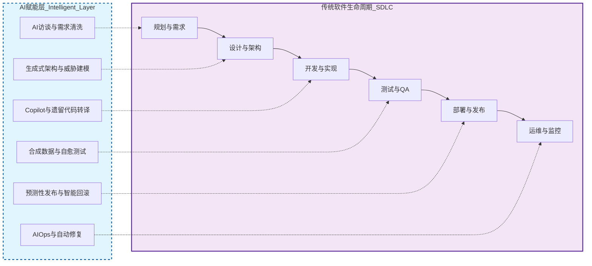
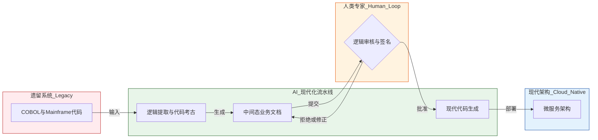
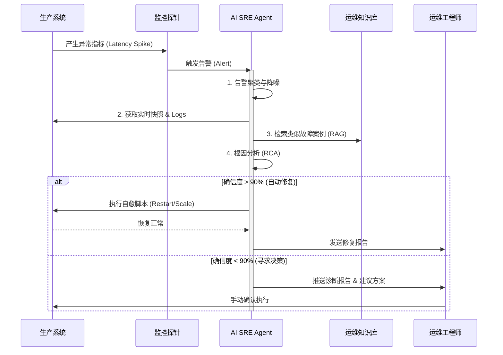

# 金融行业软件工程全生命周期原子活动矩阵与人工智能赋能深度研究报告

## 摘要

本报告旨在为全球金融服务行业的软件工程领导者、首席技术官（CTO）及数字化转型决策者提供一份详尽的参考指南。报告深入解构了软件工程全生命周期（SDLC）的原子活动矩阵，并系统性地探讨了人工智能（AI），特别是生成式人工智能（Generative AI）和大语言模型（LLM）对这些原子活动的深度赋能形式。鉴于金融行业对安全性、合规性及遗留系统现代化的特殊要求，本报告特别聚焦于摩根大通（JPMorgan Chase）、高盛（Goldman Sachs）、摩根士丹利（Morgan Stanley）、美国银行（Bank of America）及纽约梅隆银行（BNY Mellon）等顶级金融机构的实战案例。通过对数万字的研究材料进行综合分析，报告揭示了从“辅助编码”向“AI 原生工程”转型的行业趋势，论证了 AI 如何通过代理式工作流（Agentic Workflow）重塑软件生产力，并详细阐述了随之而来的技术治理与风险管理挑战。

## 1. 引言：软件工程原子化与金融数字化转型的交汇

在当今高度数字化的金融生态系统中，软件工程已不再仅仅是编写代码的技术活动，而是支撑银行、保险和资产管理公司核心竞争力的工业化生产体系。随着金融科技（FinTech）的迅猛发展和监管科技（RegTech）需求的日益严苛，传统的软件开发生命周期（SDLC）面临着前所未有的压力：交付速度要求更快，系统稳定性要求更高，合规审查要求更严。为了在这一复杂的不可能三角中寻求突破，必须将庞大的 SDLC 解构为不可再分、可度量、可自动化的“原子活动”（Atomic Activities）。

与此同时，人工智能技术的爆发式增长，尤其是基于 Transformer 架构的大模型技术，为软件工程带来了范式级的变革。AI 不再局限于外挂式的辅助工具，而是正在渗透进 SDLC 的每一个原子环节，形成了“人机协同”的新质生产力。

在金融领域，这种变革尤为剧烈且具有特殊性。不同于互联网公司，金融机构背负着沉重的遗留系统（Legacy Systems）包袱——数以亿行计的 COBOL 代码仍在支撑着全球的支付与清算体系。AI 在遗留系统现代化、自动化合规检查以及大规模复杂系统运维中的应用，正成为金融行业技术战略的核心。

本报告将依据 ISO/IEC 12207 等国际标准及现代 DevOps 实践，构建一套覆盖规划、设计、开发、测试、发布、运维及治理全流程的原子活动矩阵，并结合具体的技术实现路径与行业案例，深入剖析 AI 的赋能机制。

## 2. 阶段一：规划与需求工程 (Planning & Requirements Engineering)

需求工程是软件开发的源头，也是历史上歧义性最高、最依赖人工沟通且纠错成本最高的环节。在金融领域，需求往往与复杂的金融产品逻辑、跨地域的监管条文（如 Basel III, GDPR, MiFID II）以及精算逻辑紧密交织，任何微小的需求误解都可能导致巨大的经济损失或合规风险。

### 2.1 原子活动矩阵：需求阶段

| 二级阶段                       | 原子活动 (Atomic Activity)          | 传统执行方式与痛点                                                            | AI 赋能后的执行形态                                                                                                                |
| :----------------------------- | :---------------------------------- | :---------------------------------------------------------------------------- | :--------------------------------------------------------------------------------------------------------------------------------- |
| **需求获取 (Elicitation)**     | **利益相关者识别与访谈**            | 依赖 BA（业务分析师）人工访谈，易遗漏关键决策人，访谈记录非结构化，回溯困难。 | **AI 访谈代理**：利用语音转文本（ASR）和 NLP 技术实时转录会议，自动提取关键需求点；AI Agent 可作为虚拟分析师主动向业务方追问细节。 |
|                                | **遗留系统逻辑逆向分析**            | 依靠资深员工阅读旧代码或过时文档，甚至“口口相传”，知识流失风险极高。          | **代码考古与逻辑提取**：AI 深度解析 COBOL/Mainframe 旧系统代码，自动生成当前系统的功能规格说明书，为新需求提供基准。               |
|                                | **监管合规性扫描**                  | 人工查阅海量法律文档，确认业务需求是否违规，极度依赖合规官的个人经验。        | **RAG 合规引擎**：利用检索增强生成（RAG）技术，将需求文档与实时更新的监管法规库比对，自动标记合规风险点（如数据跨境、KYC 要求）。  |
| **需求分析 (Analysis)**        | **用户故事 (User Story) 拆解**      | 依赖 PM 经验拆解，粒度不均，依赖关系混乱，容易导致开发阶段的阻塞。            | **智能任务分解**：LLM 根据史诗（Epic）自动生成符合 INVEST 原则的原子化用户故事，并建立任务间的依赖图谱。                           |
|                                | **验收标准 (AC) 定义**              | 往往描述模糊，缺乏可测性，导致开发与测试理解不一致。                          | **Gherkin 自动生成**：AI 根据用户故事自动生成 Given-When-Then 格式的验收标准，直接转化为自动化测试脚本的输入。                     |
| **需求规格化 (Specification)** | **领域模型 (Domain Modeling) 构建** | 手工绘制 UML 图，容易与实际业务实体脱节，维护成本高。                         | **文本到模型转换**：AI 从自然语言需求中提取实体及其关系，自动生成初始的领域模型（如账户、交易、清算实体关系图）。                  |
| **需求验证 (Validation)**      | **需求一致性与冲突检查**            | 依靠人工评审会议，难以发现大规模需求集中的逻辑矛盾。                          | **逻辑推理验证**：AI 语义分析引擎检查数千个需求条目，自动识别逻辑冲突（如两个功能对同一数据的处理逻辑互斥）。                      |

### 2.2 深度分析：AI 赋能的机制与价值

在需求阶段，AI 的核心价值在于消除歧义与知识结构化。

- **自然语言理解与结构化提取**：传统的软件需求规格说明书（SRS）往往是静态的文本堆砌，缺乏可执行性。AI 通过大语言模型（LLM）的自然语言处理能力，能够将非结构化的访谈记录、电子邮件和法律文档转化为结构化的数据模型。例如，AI 可以识别出“用户转账”这一描述背后的所有隐性约束（如限额、反洗钱扫描、T+1 到账等），并将其显性化为具体的验收标准。
- **监管科技（RegTech）的左移**：金融行业的一个显著趋势是将合规检查从“事后审计”前置到“需求分析”阶段。通过构建基于向量数据库的法规知识库，AI 助手可以在业务分析师撰写需求文档的同时，实时提示该功能可能触犯的法律条款。这种“设计即合规”（Compliance by Design）的方法大幅降低了后期的返工成本。

### 2.3 全球金融行业案例深度剖析

#### 高盛 (Goldman Sachs)：Legend 平台与数据治理的民主化

高盛不仅是投行，更是一家技术公司。其开源的 Legend 数据管理与建模平台是 AI 赋能需求工程的典范。

- **背景与挑战**：金融数据极其复杂，交易、风控、合规部门对同一数据的定义往往存在偏差，导致需求沟通成本极高。
- **AI 赋能形式**：高盛利用 AI 增强了 Legend 平台的能力。通过集成 LLM，非技术人员（如银行家、合规官）可以使用自然语言查询复杂的数据模型，验证业务逻辑是否被正确定义。更重要的是，Legend 允许将数据治理策略定义为代码（Policy-as-Code），AI 辅助工具能够确保新提出的数据需求符合既定的治理标准。
- **成效**：通过 Legend，高盛实现了跨部门的数据语义统一，大幅减少了因数据定义不清导致的需求返工。其与 Snowflake 等云平台的集成，使得经过治理的数据模型可以直接转化为可执行的数据库架构，实现了从需求到实现的无缝衔接。

#### 摩根大通 (JPMorgan Chase)：LLM Suite 作为分析师的超级助手

摩根大通部署了名为 LLM Suite 的内部 AI 平台，该平台被设计为通用的生产力工具，深入渗透到需求分析环节。

- **应用场景**：业务分析师利用 LLM Suite 处理海量的市场研究报告、美联储会议纪要及内部政策文档。AI 助手能够迅速摘要关键信息，起草产品需求文档（PRD），并自动生成初步的用户故事列表。
- **技术细节**：该系统集成了 RAG 技术，确保生成的文档引用了确切的内部数据源，避免了模型幻觉带来的风险。据报道，这一工具已覆盖该行数万名员工，显著提升了从业务构想到技术需求的转化效率。

## 3. 阶段二：系统设计与架构 (Architecture & Design)

架构设计决定了系统的稳健性、可扩展性、安全性及长期维护成本。在 AI 时代，架构设计正从纯粹依赖架构师个人经验的“艺术创作”，转向由数据驱动和 AI 辅助的“生成式设计”。

### 3.1 原子活动矩阵：设计阶段

| 二级阶段                       | 原子活动 (Atomic Activity)     | 传统执行方式与痛点                                               | AI 赋能后的执行形态                                                                                                    |
| :----------------------------- | :----------------------------- | :--------------------------------------------------------------- | :--------------------------------------------------------------------------------------------------------------------- |
| **高层架构 (High-Level)**      | **架构模式选型**               | 基于架构师的主观偏好选择（如微服务 vs 单体），难以量化评估优劣。 | **架构推荐引擎**：AI 根据非功能需求（TPS、延迟、可用性 SLA）推荐最佳架构模式，并提供基于历史数据的量化对比分析。       |
|                                | **技术栈决策**                 | 调研耗时，容易引入不成熟或已停止维护的技术组件。                 | **技术雷达匹配**：AI 分析技术组件的社区活跃度、漏洞记录及企业内部技术标准，推荐合规的技术栈组合。                      |
| **详细设计 (Detailed Design)** | **API 契约定义**               | 手工编写 Swagger/OpenAPI 文件，繁琐且容易与实现脱节。            | **智能契约生成**：AI 根据用户故事和领域模型，自动生成完整的 OpenAPI 规范，包括请求/响应示例和错误码定义。              |
|                                | **数据库 Schema 设计**         | 需人工考虑范式、索引优化，难以预判数据量暴增后的性能瓶颈。       | **预测性数据建模**：AI 基于预期数据增长率生成优化的 Schema，并自动建议索引策略和分库分表方案。                         |
| **安全架构设计**               | **威胁建模 (Threat Modeling)** | 依赖安全专家进行 STRIDE 分析，经常成为项目瓶颈，覆盖率不足。     | **自动化威胁识别**：AI 分析架构图和数据流图（DFD），自动识别潜在攻击面（如未加密的链路、弱认证接口），并建议缓解措施。 |

### 3.2 深度分析：生成式架构与安全左移

- **从草图到代码的生成式架构**：AI 正在改变架构师的工作方式。现在，架构师可以在白板上绘制草图，或用自然语言描述系统行为（例如“设计一个高并发的股票撮合系统，基于 Kafka 和 Redis”），AI 工具（如 AWS 的生成式 AI 助手）能够将其转化为标准的架构图（如 Mermaid、PlantUML），并生成相应的基础设施即代码（IaC）模板（如 Terraform、CloudFormation）。这不仅加快了设计速度，还确保了架构文档与实施代码的一致性。
- **安全设计的自动化（Security by Design）**：在金融行业，安全性必须内置于架构之中。传统的威胁建模往往在设计完成后进行，甚至在开发后期才介入。AI 驱动的威胁建模工具能够实现“安全左移”。它能够理解系统的拓扑结构，自动应用安全设计模式（如零信任架构原则），并在设计阶段就拦截不安全的架构决策（如直接暴露数据库端口）。

### 3.3 全球金融行业案例深度剖析

#### 摩根大通 (JPMorgan Chase)：Threat Modeling Co-Pilot

摩根大通不仅在代码层面应用 AI，更将其引入架构设计阶段。其 Threat Modeling Co-Pilot 是一个革命性的工具。

- **功能与机制**：该工具利用 AI 解析软件的架构设计文档和数据流图。它不仅能识别出通用的安全漏洞（如 OWASP Top 10），还能结合摩根大通内部独特的安全策略和历史攻击数据，指出特定业务场景下的深层风险。
- **价值**：它将威胁建模这一通常由资深安全专家把持的稀缺能力“民主化”，赋予了普通开发人员和架构师进行自我安全审查的能力。这意味着安全审查不再是发布的瓶颈，而是融入了日常设计流程。

#### Capital One：Serverless 架构的自动化治理

作为全面上云的先驱，Capital One 面临着管理成千上万个微服务和 Serverless 函数的挑战。

- **AI 治理**：Capital One 建立了一套基于 AI 的架构治理体系。在设计和部署阶段，AI 模型会自动评估 Lambda 函数的配置（如内存分配、超时设置、并发限制）。
- **预测性优化**：系统能够预测函数在不同负载下的表现，并自动建议最优的架构配置，以在性能和成本之间取得平衡。这种“架构即代码”加上 AI 优化的模式，确保了其庞大的云原生架构始终保持高效和合规。

## 4. 阶段三：开发与实现 (Implementation & Coding)

这是 AI 渗透最深、影响最直接，也是金融行业投入资源最多的阶段。从简单的代码补全到复杂的遗留系统重写，AI 正在从根本上改变程序员的日常工作内容，将他们从“代码搬运工”升级为“逻辑编排者”。

### 4.1 原子活动矩阵：开发阶段

| 二级阶段                     | 原子活动 (Atomic Activity)      | 传统执行方式与痛点                                                    | AI 赋能后的执行形态                                                                                                          |
| :--------------------------- | :------------------------------ | :-------------------------------------------------------------------- | :--------------------------------------------------------------------------------------------------------------------------- |
| **编码实现 (Coding)**        | **样板代码 (Boilerplate) 编写** | 手写 DTO、实体类、配置类、CRUD 方法，枯燥乏味且易出错。               | **Copilot 自动生成**：AI 根据上下文自动生成完整的类和方法，涵盖日志记录、异常处理等标准化代码。                              |
|                              | **核心算法与逻辑实现**          | 需频繁查阅 API 文档、StackOverflow，编码中断频繁。                    | **上下文感知补全**：AI 理解业务意图，直接生成复杂的业务逻辑代码（如利息计算算法），并确保符合内部编码规范。                  |
| **遗留代码迁移 (Migration)** | **遗留代码迁移**                | 人工重写 COBOL/Mainframe 代码，风险极高，不仅成本昂贵且易引入新 Bug。 | **AI 代码转译与重构**：AI 将 COBOL 代码逻辑转换为中间表示（如英文规格书），再生成现代 Java/Python 代码，实现逻辑的精确迁移。 |
| **代码优化 (Refactoring)**   | **代码异味 (Smell) 识别与修复** | 依赖静态扫描工具（SonarQube），误报多，且不提供修复代码。             | **智能重构建议**：AI 识别复杂的逻辑异味（如意大利面条代码），并提供重构后的代码版本，解释重构理由。                          |
|                              | **单元测试编写**                | 开发人员往往因时间紧迫而忽略，覆盖率低，边界条件测试不足。            | **测试用例生成**：AI 分析代码路径，自动生成高覆盖率的单元测试，特别是针对边缘情况（Edge Cases）的测试。                      |
| **代码审查 (Review)**        | **Pull Request (PR) 描述**      | 开发者往往写得简略，审查者难以快速理解变更背景。                      | **PR 自动摘要**：AI 分析 Diff，自动生成详细的变更说明、影响范围分析及测试建议。                                              |
|                              | **同行评审 (Peer Review)**      | 耗时，容易受人情因素影响，且难以发现深层逻辑错误。                    | **AI 审查代理**：AI Agent 预审代码，标记 Bug、安全漏洞、风格问题，甚至直接提交修复建议供人类确认。                           |

### 4.2 深度分析：遗留系统现代化的“奇点”与 AI 结对编程

- **遗留系统现代化的革命**：对于全球顶级银行而言，大型机（Mainframe）和 COBOL 代码是数字化转型的最大阻碍。过去，银行要么选择风险极高的“推倒重来”，要么选择昂贵的“封装不动”。生成式 AI 的出现改变了这一格局。AI 能够理解古老的编程语言（COBOL, JCL, PL/1），提取其中的业务规则（Business Logic Extraction），并将其转化为现代语言（Java, Go）。这不仅仅是语法翻译，更是一种“逻辑重构”，将面向过程的代码转换为面向对象的微服务架构。这一突破使得银行能够在保留核心业务逻辑资产的同时，摆脱对稀缺 COBOL 程序员的依赖。

- **代码上的机器学习 (MLonCode)**：金融机构正在构建私有的代码大模型。这些模型不仅要在公开代码集上训练，更要在银行内部数十年积累的高质量代码库上进行微调（Fine-tuning）。这意味着 AI 助手不仅懂 Java，还懂“高盛的 Java 风格”、“摩根大通的加密库用法”以及“内部特有的消息队列协议”。这种上下文感知能力是通用模型无法比拟的。

### 4.3 全球金融行业案例深度剖析

#### 摩根士丹利 (Morgan Stanley)：DevGen.AI 与 28 万小时的奇迹

摩根士丹利开发了名为 DevGen.AI 的内部工具，这是一个基于 GPT-4 构建的定制化平台，专门用于解决遗留代码迁移难题。

- **创新流程**：与直接让 AI 转译代码不同，摩根士丹利采用了一种更为稳健的“中间态”策略。DevGen.AI 首先分析 COBOL 代码，生成详细的英文业务规格说明书（English Specifications）。人类专家审核这些规格书，确保逻辑无误后，再由 AI 或开发者将其转换为现代代码。
- **价值**：这种方法解决了 AI“黑箱”问题，确保了金融逻辑的透明性和可追溯性。据官方数据，该工具已处理了超过 900 万行代码，为银行节省了约 280,000 小时的开发时间。这不仅是效率的提升，更是风险的极大降低。

#### 美国银行 (Bank of America)：Codey 的全面部署

美国银行在其内部大规模推广了基于 Google Cloud 的 Codey 模型（PaLM 2 的代码专用版）。

- **应用规模**：该工具被分发给成千上万名开发人员。
- **成效**：据银行内部统计，开发人员的编码效率提升了约 30%。特别是在编写重复性的 ETL 脚本、API 胶水代码以及数据转换逻辑时，AI 展现出了极高的准确率。这使得开发人员能够将精力集中在更复杂的算法交易策略和客户体验创新上。

#### 摩根大通 (JPMorgan Chase)：Senatus AI 与 PRBuddy

摩根大通的 CTO 应用研究团队开发了 Senatus AI，这是一个先进的 MLonCode 工具包。

- **技术深度**：Senatus 利用了 De-skew LSH（Locality Sensitive Hashing）算法来解决大规模代码检索的效率问题，实现了毫秒级的相似代码推荐。
- **开发者体验**：其子工具 PRBuddy 深度集成在 GitHub/GitLab 流程中。当开发者提交代码时，PRBuddy 会自动介入，生成结构化的 PR 描述，自动补充缺失的单元测试，并提示潜在的代码规范违例。这不仅加快了代码审查的速度，还通过标准化的 AI 检查提升了代码库的整体质量。

#### 富国银行 (Wells Fargo)：COBOL 到 Java 的 AI 驱动迁移

富国银行与 Globant 合作，利用 AI Agent 技术加速其核心系统的现代化。

- **成效**：在一个为期 4 周的试点项目中，AI 帮助将复杂的 COBOL 存储过程转换为 Java 微服务，重构时间缩短为传统方法的 1/5，且代码文档覆盖率达到了 77%。这一案例证明了 AI 在处理高复杂度、高风险金融系统核心代码时的可行性。

## 5. 阶段四：测试与质量保证 (Testing & QA)

金融软件的零容错特性（一笔交易错误可能导致数亿美元损失）使得测试成为 SDLC 中成本最高、耗时最长的环节。AI 正在推动测试从“自动化测试”向“自主测试”和“智能质量工程”演进。

### 5.1 原子活动矩阵：测试阶段

| 二级阶段     | 原子活动 (Atomic Activity) | 传统执行方式与痛点                                                  | AI 赋能后的执行形态                                                                                                                                          |
| :----------- | :------------------------- | :------------------------------------------------------------------ | :----------------------------------------------------------------------------------------------------------------------------------------------------------- |
| **测试设计** | **测试场景与用例生成**     | 依赖测试人员理解需求，容易遗漏边界条件和异常流程。                  | **基于模型的测试生成**：AI 解析需求文档和代码逻辑，自动生成全覆盖的测试用例，包括正向、逆向及极端边界场景。                                                  |
| **数据管理** | **测试数据准备 (TDM)**     | 使用生产数据脱敏，流程繁琐，且存在 PII 泄露风险；手动造数效率低。   | **合成数据生成 (Synthetic Data)**：AI 学习生产数据的统计分布（如交易金额分布、用户行为模式），生成高度逼真的合成数据，既保留业务特征又完全合规（隐私保护）。 |
| **测试执行** | **UI 自动化测试**          | 基于 DOM 定位的脚本（Selenium）极易因 UI 微调而失效，维护成本极高。 | **自愈测试 (Self-Healing)**：AI 依靠视觉识别和多属性定位，当某个元素 ID 变化时，自动找到该元素的新位置并修复脚本，无需人工干预。                             |
|              | **视觉回归测试**           | 人工肉眼比对截图，容易漏过细微的样式错乱。                          | **视觉 AI 比对**：AI 像素级比对新旧版本截图，智能忽略动态内容（如时间戳），精准识别布局崩坏。                                                                |
| **测试优化** | **回归测试选择 (RTS)**     | 为了保险起见，往往全量运行测试集，耗时数小时甚至数天。              | **预测性测试选择**：AI 分析代码变更与测试用例的关联性，精确计算出受影响的最小测试子集，将回归测试时间缩短至分钟级。                                          |

### 5.2 深度分析：合成数据与自愈系统

- **合成数据（Synthetic Data）的战略意义**：在 GDPR 和 CCPA 等隐私法规日益严格的背景下，金融机构越来越难以直接使用生产数据进行测试。生成式 AI 能够生成“看起来像真数据，统计学上等同于真数据，但完全不是真数据”的合成数据集。这不仅解决了合规问题，还能生成现实中罕见但在理论上存在的极端场景数据（如负油价、闪崩），从而对交易系统进行更深度的压力测试。
- **测试脚本的自愈能力**：测试脆性（Test Brittleness）是自动化测试的顽疾。AI 驱动的测试工具引入了“视觉感知”和“语义感知”。当脚本找不到“登录”按钮时，AI 会像人类一样去寻找页面上“长得像登录按钮”或者“文本是 Login”的元素，并动态调整测试步骤。这种能力显著降低了自动化测试的维护成本，使得持续测试（Continuous Testing）在快速迭代中成为可能。

### 5.3 全球金融行业案例深度剖析

#### 高盛 (Goldman Sachs)：从被动测试到主动质量工程

高盛通过 AI 技术重塑了其 QA 体系。

- **策略转变**：从传统的“发现 Bug”转变为“预防 Bug”。高盛利用 AI 分析历史代码库中的 Bug 模式，识别出哪些代码模块是高风险区域（Hotspots）。
- **智能分配**：基于风险预测，系统会自动建议在这些高风险模块增加测试覆盖率，而在低风险区域减少不必要的回归测试。此外，高盛还利用 AI 生成复杂的衍生品交易组合数据，用于系统的压力测试和风险模型验证。

#### Citi (花旗集团)：自动化合规测试

花旗集团利用 AI 技术自动化其合规测试流程。

- **场景**：针对不断变化的全球金融法规，AI 系统能够自动生成针对新法规的测试用例。例如，当欧盟发布新的支付指令时，系统会自动生成测试场景，验证支付网关是否拦截了不符合新规的交易。这种自动化的合规测试确保了软件发布即合规。

## 6. 阶段五：部署与发布 (Deployment & Release)

发布环节是软件生命周期中风险最高的时刻。AI 的引入旨在实现“无人值守”的智能发布，通过数据驱动的决策替代人工直觉。

### 6.1 原子活动矩阵：发布阶段

| 二级阶段     | 原子活动 (Atomic Activity)   | 传统执行方式与痛点                                                 | AI 赋能后的执行形态                                                                                                                         |
| :----------- | :--------------------------- | :----------------------------------------------------------------- | :------------------------------------------------------------------------------------------------------------------------------------------ |
| **发布编排** | **发布计划与依赖管理**       | 人工协调多个微服务的发布顺序，容易出现版本不兼容导致的事故。       | **智能发布编排**：AI 分析服务间的 API 依赖关系和版本兼容性矩阵，自动生成最优的发布顺序图，并检测潜在的依赖冲突。                            |
| **部署验证** | **金丝雀发布 (Canary) 分析** | 依靠运维人员观察监控仪表盘，判断新版本是否正常，容易漏过隐性问题。 | **AI 金丝雀分析**：AI 实时对比新旧版本的数千个监控指标（CPU、内存、业务转化率），利用统计学算法判定新版本是否健康，发现异常毫秒级自动回滚。 |
| **变更管理** | **风险评分与审批**           | 基于简单的规则（如是否涉及核心库）进行审批，缺乏量化依据。         | **变更风险预测**：AI 综合分析代码复杂度、测试覆盖率、开发者经验、历史故障数据，为每次变更计算“风险分”。高分变更自动触发严格审批流。         |
| **文档生成** | **发布说明 (Release Notes)** | 开发者手工编写，往往语焉不详，甚至与实际代码变更不符。             | **自动变更日志**：AI 分析所有 Commit 信息和工单内容，自动生成面向用户和运维的详细发布说明，包括新功能、Bug 修复及配置变更项。               |

### 6.2 深度分析：AI 驱动的渐进式交付

- **预测性发布风险管理**：AI 模型可以学习过去数年所有的变更记录和故障记录，建立一个“变更-故障”关联模型。在新的代码提交时，AI 可以预测：“这个变更修改了核心计费模块，且测试覆盖率略有下降，导致故障的概率为 85%。” 这种预测能力让管理者能够在故障发生前就进行干预。
- **从自动化回滚到智能回滚**：传统的自动化回滚通常基于简单的阈值（如错误率 > 1%）。而 AI 驱动的回滚可以基于更复杂的业务指标模式识别。例如，虽然系统没有报错，但用户的“下单转化率”突然下降了 5%，或者“平均持仓时间”出现了异常波动。AI 能够捕捉到这些业务层面的异常，并果断执行回滚，保护业务价值。

### 6.3 全球金融行业案例深度剖析

#### 摩根大通 (JPMorgan Chase)：蓝图 (Blueprints) 与智能交付

摩根大通构建了基于“蓝图”的云交付平台，结合 AI 优化其大规模微服务部署。

- **机制**：该系统利用机器学习分析历史部署数据，识别出发布成功率最高的时间窗口。例如，AI 可能建议避开周五下午或特定的市场交易高峰期进行发布。
- **策略即代码**：在部署前，AI 会扫描所有的 Terraform 和 Kubernetes 配置文件，确保其符合银行的安全策略（如禁止开放公网 S3 桶）。这种前置的智能检查确保了部署的标准化和安全性。

## 7. 阶段六：运维与监控 (Operations & SRE)

运维阶段的目标是保障系统的可靠性（Reliability）。AIOps（智能运维）已成为该领域的标准术语，AI 正在将运维人员从繁琐的告警中解放出来。

### 7.1 原子活动矩阵：运维阶段

| 二级阶段                   | 原子活动 (Atomic Activity) | 传统执行方式与痛点                                                           | AI 赋能后的执行形态                                                                                                                                 |
| :------------------------- | :------------------------- | :--------------------------------------------------------------------------- | :-------------------------------------------------------------------------------------------------------------------------------------------------- |
| **监控 (Monitoring)**      | **异常检测与阈值设置**     | 依赖静态阈值（如 CPU > 80%），无法适应动态负载，误报（False Positive）极多。 | **动态基线监测**：AI 学习指标的历史模式（如周一早高峰高负载是正常的），自动设置动态阈值，精准识别真正的异常。                                       |
| **事件管理 (Incident)**    | **告警降噪与关联**         | 海量告警淹没运维人员（告警风暴），难以区分根本原因和衍生症状。               | **告警聚类与根因分析**：AI 利用图算法和时序分析，将相关的成百上千个告警聚合为一个“事件”，并指出可能的根因（如数据库锁等待导致了上层所有服务超时）。 |
| **故障恢复 (Remediation)** | **应急响应与修复**         | 依赖人工查阅 Runbook，手动执行命令，响应慢且容易手误。                       | **AI SRE Agent**：AI 自动匹配故障模式，推荐或经授权后自动执行修复脚本（如重启 Pod、扩容、清理磁盘），实现系统自愈。                                 |
| **知识管理**               | **事后复盘 (Post-Mortem)** | 人工撰写事故报告，耗时且容易遗漏细节。                                       | **智能复盘生成**：AI 自动收集故障期间的聊天记录、日志、操作记录，自动生成时间线（Timeline）和事故报告初稿。                                         |

### 7.2 深度分析：AI SRE 与 ChatOps

- **AI SRE (Site Reliability Engineering)**：这是一种全新的运维范式。AI 不再只是监控工具，而是作为虚拟的 SRE 工程师参与值班。当故障发生时，AI SRE 会自动拉起应急会议，收集相关指标快照，查询最近的变更记录，甚至尝试执行无害的探针操作。在 ilert 或 PagerDuty 等平台中，AI SRE 已经能够处理超过 80% 的 L1 级报警，让真人工程师专注于复杂的系统架构问题。

- **ChatOps 的进化**：通过集成 LLM，运维人员可以使用自然语言与系统交互。例如，在 Slack 中输入“检查过去 10 分钟支付网关的延迟情况，并与上周同期对比”，AI 机器人会自动编写 SQL 或 PromQL 查询，并生成可视化的图表反馈。这极大地降低了运维的技术门槛和操作时间。

### 7.3 全球金融行业案例深度剖析

#### Capital One：云原生 AIOps 与自愈系统

作为全栈上云的银行，Capital One 拥有极其复杂的 AWS 基础设施。

- **应用**：Capital One 利用 AIOps 工具监控其 Serverless 架构。系统能够检测出微服务之间极其细微的延迟变化异常，这些往往是数据库死锁或网络抖动的先兆。
- **自愈**：对于一些已知模式的故障（如某个非核心服务的内存泄漏），AI SRE 获得了自动处置权限，可以自动触发重启或隔离操作。这使得其系统在面对海量交易冲击时仍能保持高可用性。

#### 德意志银行 (Deutsche Bank)：Google Cloud 战略合作

德意志银行与 Google Cloud 达成深度合作，利用 Google 的 Vertex AI 和 AIOps 套件优化其交易系统。

- **价值**：AI 模型分析每天产生的数 PB 交易日志和系统日志，识别传统规则引擎无法发现的复杂故障模式（如跨系统的慢事务）。这不仅将根因分析的时间从数小时缩短到几分钟，还帮助银行预测并规避了多次潜在的系统停机风险。

## 8. 核心贯穿：安全、合规与治理 (Security, Compliance & Governance)

在金融行业，安全与合规不是一个独立的阶段，而是贯穿 SDLC 始终的生命线。AI 正在帮助银行实现“持续合规”和“自动化治理”。

### 8.1 原子活动矩阵：合规与治理

| 二级阶段     | 原子活动 (Atomic Activity)      | 传统执行方式与痛点                                       | AI 赋能后的执行形态                                                                                                                |
| :----------- | :------------------------------ | :------------------------------------------------------- | :--------------------------------------------------------------------------------------------------------------------------------- |
| **代码合规** | **KYC/AML 逻辑审查**            | 人工审计代码，难以确保每一行代码都符合复杂的反洗钱逻辑。 | **语义代码审计**：AI 理解业务代码语义，自动验证是否包含了必要的 KYC 检查步骤，防止逻辑漏洞。                                       |
|              | **数据合规 (PII/敏感数据扫描)** | 基于正则表达式的扫描，容易漏过非结构化数据中的隐私信息。 | **NLP 隐私识别**：AI 利用自然语言理解能力，识别代码注释、日志输出甚至变量命名中的敏感信息（如客户姓名、证件号）。                  |
| **策略执行** | **策略即代码 (Policy-as-Code)** | 依赖人工审批文档，策略执行不彻底，存在“影子 IT”。        | **自动策略生成与执行**：AI 将自然语言的监管政策转化为 OPA（Open Policy Agent）代码，嵌入 CI/CD 流水线强制执行。                    |
| **审计**     | **审计踪迹 (Audit Trail)**      | 审计师人工抽查项目，耗时数月，且只能覆盖冰山一角。       | **AI 虚拟审计员**：AI 持续监控所有 DevOps 数据，回答审计师的自然语言提问（如“列出所有未经测试就上线的变更”），并自动生成审计报告。 |

### 8.2 深度分析：AI 驱动的自动化合规

- **从文档合规到代码合规**：传统的合规是基于文档的（Document-based），而 AI 推动了向基于代码的合规（Code-based）转型。AI 可以解读最新的美联储或欧盟法规，自动更新系统中的合规规则库。例如，当监管机构调整了转账限额规定，AI 可以自动定位代码库中所有涉及限额的硬编码或配置项，并提示开发者修改。
- **KYC/AML 的智能化集成**：在软件开发中，AI Agent 被用于模拟复杂的洗钱场景，对系统的反洗钱（AML）模块进行对抗性测试。这确保了系统不仅在功能上正常，而且在面对真实世界的金融犯罪时具有足够的防御能力。

### 8.3 全球金融行业案例深度剖析

#### 纽约梅隆银行 (BNY Mellon)：Eliza 平台与 AI 治理

BNY Mellon 的 Eliza 不仅仅是一个开发平台，更是一个严密的 AI 治理系统。

- **合规内置**：所有在 Eliza 上开发的 AI 应用，都会自动继承银行的风险管理和合规框架。AI 会自动扫描新生成的代码，确保其没有引入开源许可证风险或安全漏洞。
- **合同与法规分析**：Eliza 利用 NLP 技术分析数以万计的托管协议和法规文档，自动提取合规义务，并将其转化为系统监控规则。这确保了银行的软件行为始终与法律义务保持一致。

#### 花旗集团 (Citi)：监管变更管理的自动化

花旗利用 GenAI 来应对全球监管环境的快速变化。

- **机制**：其 AI 系统能够扫描全球各地的监管发布网站，自动读取新的监管文件，并将其映射到银行内部的 IT 控制点（Controls）。如果发现某项新法规需要修改特定的软件模块，系统会自动创建工单通知相关团队。这实现了监管变更管理的闭环自动化。

## 9. 结论与展望

通过对软件工程全生命周期原子活动矩阵的构建及 AI 赋能形式的深度剖析，我们可以得出以下结论：

1. **AI 已从“工具”进化为“队友”**：在金融软件工程中，AI 不再仅仅是提高打字速度的 Copilot，而是正在演变为能够独立完成任务（如代码迁移、故障自愈、合规审计）的 Agent。
2. **遗留系统现代化迎来转折点**：生成式 AI 为困扰银行业数十年的主机包袱提供了切实可行的解法。通过 AI 驱动的“逻辑提取-重构”路径，银行有望在未来 5-10 年内完成核心系统的彻底革新。
3. **合规与效率不再对立**：通过 RegTech 与 DevOps 的融合，AI 使得“实时合规”成为可能，打破了“要速度就牺牲安全”的传统魔咒。

然而，挑战依然存在。随着 AI 生成代码比例的增加，模型风险（Model Risk）、AI 幻觉（Hallucination）以及初级工程师能力的空心化正成为新的风险点。金融机构必须建立全新的 AI 治理框架（AI TRiSM），在拥抱技术红利的同时，确保系统的可控性与安全性。

未来，能够成功驾驭 AI Agent 并重塑其软件工程文化的金融机构，将从单纯的资金中介进化为智能化的科技巨头。
